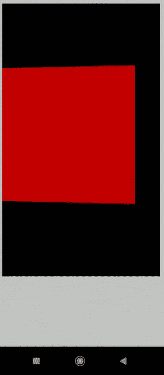
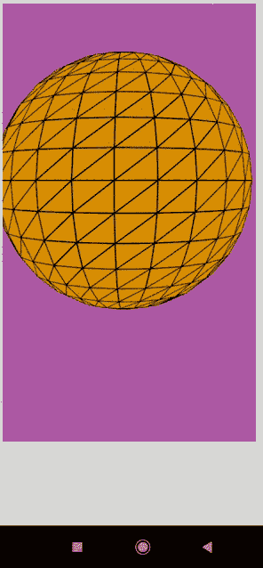

# p5.js 旋转 y 事件

> 原文:[https://www.geeksforgeeks.org/p5-js-rotationy-event/](https://www.geeksforgeeks.org/p5-js-rotationy-event/)

p5.js 中的系统变量 **rotationY** 负责移动设备(智能手机和平板电脑)始终沿着 y 轴的旋转。它可以在 draw()函数中使用，以连续获取当前沿 y 轴的旋转。如果图形角度模式()设置为度数，则该值将在-90 到 90 的范围内。当设置为 RADIANS 时，该值将在-PI/2 到 PI/2 之间。

**注意:**如果三个变量一起使用，旋转的调用顺序很重要。需要按照 Z、Y 和 X 的顺序调用它们，以防止不一致。

**语法:**

```
rotationY
```

**例 1:**

## java 描述语言

```
// Rotate the the device at 90 degree.
function setup() {
  createCanvas(600, 600, WEBGL);
}

function draw() {
  background(2);

  // Set the rotation to be equal to
  // the variable rotationY
  rotateY(radians(rotationY));

  fill('red');
  box(200, 200, 200);
}
```

**输出:**



**例 2:**

## java 描述语言

```
// Rotate the the device at  0 to 360 degree.
function setup() {
  createCanvas(600, 600, WEBGL);
}

function draw() {
  background(205, 105, 194);

  // Set the rotation to be equal to
  // the variable rotationY
  rotateY(radians(rotationY));

  fill('orange');
  sphere(140);
}
```

**输出:**

