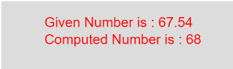

# p5.js | round()功能

> 原文:[https://www.geeksforgeeks.org/p5-js-round-function/](https://www.geeksforgeeks.org/p5-js-round-function/)

p5.js 中的 **round()** 函数用于*计算一个数字*的 round 值。它计算最接近数字的整数。

**语法**

```
round(number)

```

**参数:**该函数只接受一个参数，如上所述，如下所述:

*   **number** : This parameter stores the number to compute.

    下面的程序说明了 **round()** 函数在 P5 . js:
    T3】中的示例:

    ```
    function setup() {
        //create Canvas of size 270*80  
        createCanvas(270, 80);
    }

    function draw() {
        background(220);
        //initialize the parameter  
        let x = 67.54;
        //call to round() function
        let y = round(x);
        textSize(16);
        fill(color('red'));
        text("Given Number is : " + x, 50, 30);
        text("Computed Number is : " + y, 50, 50);
    }
    ```

    **输出:**
    

    **参考:**T2】https://p5js.org/reference/#/p5/round