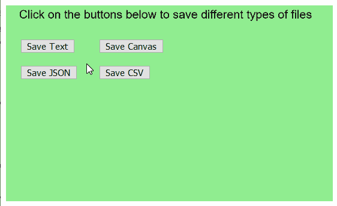
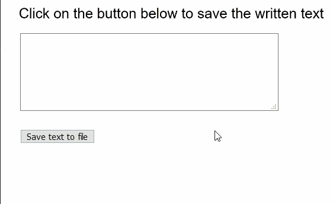

# p5.js | save()功能

> 原文:[https://www.geeksforgeeks.org/p5-js-save-function/](https://www.geeksforgeeks.org/p5-js-save-function/)

p5.js 中的 **save()功能**通过提示下载到电脑来保存到文件系统。该功能可用于保存文本、图像、JSON、CSV、wav 或 HTML 文件。默认选项是将当前画布保存为图像。
函数的第一个参数可以根据要保存的文件指定各种值。示例包括指向画布元素的指针、字符串数组、JSON 对象或 p5 数组。表格的表格元素，p5。图像或 p5 的图像元素。声音的声音文件元素。
**注意:**不建议在 draw()循环内部调用这个函数，因为每次 draw 调用都会提示一个新的保存对话框。

**语法:**

```
save( [objectOrFilename], [filename], [options] )
```

**参数:**该函数接受三个参数，如上所述，如下所述。

*   **对象或文件名:**这是一个对象或字符串，用于表示要保存的对象或文件名(如果保存画布)。如果提供了对象，它将根据对象和文件名保存文件。这是一个可选参数。
*   **文件名:**它指定用作保存文件文件名的字符串。这是一个可选参数。
*   **选项:**它是一个布尔值或字符串，为要保存的文件提供附加选项。如果是 JSON 文件，值“真”将保存针对文件大小优化的 JSON，而不是可读性。这是一个可选参数。

以下示例说明了 p5.js:
**示例 1:** 中的**保存()功能**

## java 描述语言

```
function setup() {
  createCanvas(500, 300);
  textSize(18);

  background("lightgreen");
  text("Click on the buttons below to save different types of files", 20, 20);

  // Create a button for saving text
  saveTextBtn = createButton("Save Text");
  saveTextBtn.position(30, 60);
  saveTextBtn.mousePressed(saveAsText);

  // Create a button for saving canvas image
  saveImageBtn = createButton("Save Canvas");
  saveImageBtn.position(150, 60);
  saveImageBtn.mousePressed(saveAsCanvas);

  // Create a button for saving JSON
  saveJSONBtn = createButton("Save JSON");
  saveJSONBtn.position(30, 100);
  saveJSONBtn.mousePressed(saveAsJSON);

  // Create a button for saving CSV
  saveCSVBtn = createButton("Save CSV");
  saveCSVBtn.position(150, 100);
  saveCSVBtn.mousePressed(saveAsCSV);
}

function saveAsText() {
  let textToSave = ["Hello", "GeeksforGeeks!"];
  save(textToSave, "output_text.txt");
}

function saveAsCanvas() {
  save("output_canvas.png");
}

function saveAsJSON() {
  let exampleObj = [
    {
      name: "Samuel",
      age: 23,
    },
    {
      name: "Axel",
      age: 15,
    },
  ];
  save(exampleObj, "output_text.json");
}

function saveAsCSV() {
  let exampleTable = new p5.Table();
  let newRow = exampleTable.addRow();
  exampleTable.addColumn("author");
  exampleTable.addColumn("language");
  newRow.setString("author", "Dennis Ritchie");
  newRow.setString("language", "C");

  save(exampleTable, "output_CSV.csv");
}
```

**输出:**



**例 2:**

## java 描述语言

```
function setup() {
  createCanvas(500, 300);
  textSize(22);

  text("Click on the button below to save the written text", 20, 20);

  // Create a textarea for the input of text
  inputArea = createElement("textarea");
  inputArea.position(30, 50);
  inputArea.size(400, 120);

  // Create a button for saving text
  saveBtn = createButton("Save text to file");
  saveBtn.position(30, 200);
  saveBtn.mousePressed(saveFile);
}

function saveFile() {
  // Get the value of the textarea
  // Split according to nextline characters
  stringList = inputArea.value().split("\n");

  // Save the strings to file
  save(stringList, "output_file.txt");
}
```

**输出:**



**在线编辑:**[【https://editor.p5js.org/】](https://editor.p5js.org/)
**环境设置:**[https://www . geeksforgeeks . org/P5-js-soundfile-object-installation-and-methods/](https://www.geeksforgeeks.org/p5-js-soundfile-object-installation-and-methods/)
**参考:**[https://p5js.org/reference/#/p5/save](https://p5js.org/reference/#/p5/save)