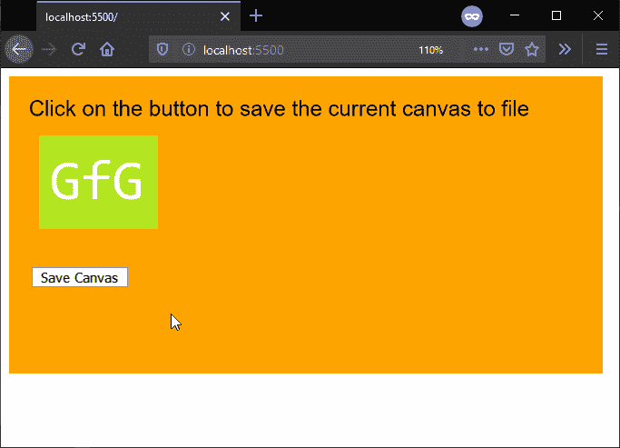

# p5.js | saveCanvas()功能

> 原文:[https://www.geeksforgeeks.org/p5-js-savecanvas-function/](https://www.geeksforgeeks.org/p5-js-savecanvas-function/)

**保存画布()功能**用于保存一个 p5。表对象转换为文件。保存的文件格式可以定义为函数的一个参数。默认情况下，它会保存一个带有逗号分隔值的文本文件，但是，它可以用于使用制表符分隔值保存文本文件，或者从中生成一个 HTML 表。

**语法:**

```
saveCanvas(selectedCanvas, filename, extension)
```

```
saveCanvas(filename, extension)
```

**参数:**该函数接受三个参数，如上所述，如下所述。

*   **选择画布:**这是 p5。将保存到文件中的表对象。
*   **文件名:**它指定用作保存文件文件名的字符串。这是一个可选参数。
*   **扩展名:**是表示要保存的文件扩展名的字符串。这是一个可选参数。

下面的例子说明了 p5.js 中的 **saveCanvas()函数**:

**示例:**

```
function preload() {
  img = loadImage('sample-image.png');
}

function setup() {
  createCanvas(600, 300);
  textSize(22);

  background("orange");
  text("Click on the button to save the"+
       " current canvas to file", 20, 40);
  image(img, 30, 60);

  // Create a button for saving the canvas
  removeBtn = createButton("Save Canvas");
  removeBtn.position(30, 200)
  removeBtn.mousePressed(saveToFile);
}

function saveToFile() {
  // Save the current canvas to file as png
  saveCanvas('mycanvas', 'png')
}
```

**输出:**



**在线编辑:**[https://editor.p5js.org/](https://editor.p5js.org/)

**环境设置:**

**参考:**T2】https://p5js.org/reference/#/p5/saveCanvas