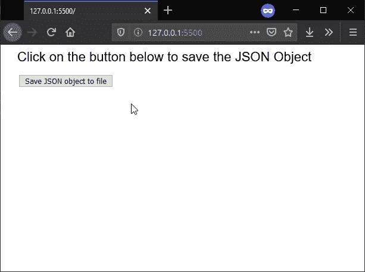
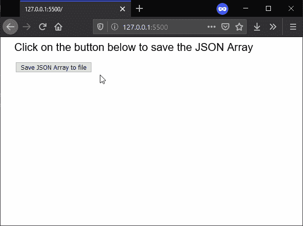

# p5.js | saveJSON()功能

> 原文:[https://www.geeksforgeeks.org/p5-js-savejson-function/](https://www.geeksforgeeks.org/p5-js-savejson-function/)

**saveJSON()函数**用于将一个对象或对象数组作为 JSON 对象写入`.json`文件。文件的保存将因网络浏览器而异。

**语法:**

```
saveJSON( json, filename, optimize )
```

**参数:**该函数接受三个参数，如上所述，如下所述:

*   **json:** 它是一个对象或对象数组，将形成要创建的 json 对象的内容。
*   **文件名:**它指定用作保存文件文件名的字符串。
*   **优化:**这是一个布尔值，它指定在写入 JSON 对象之前是否会删除换行符和空格。这是一个可选参数。

下面的例子说明了 p5.js 中的 **saveJSON()函数**:

**例 1:**

```
function setup() {
  createCanvas(600, 300);
  textSize(22);
  text("Click on the button below to "
      + "save the JSON Object", 20, 20);

  bookObj = {};
  bookObj.name = "Let US C";
  bookObj.author = "Yashavant Kanetkar";
  bookObj.price = "120";

  // Create a button for saving the JSON Object
  saveBtn = createButton("Save JSON object to file");
  saveBtn.position(30, 50)
  saveBtn.mousePressed(saveFile);
}

function saveFile() {

  // Save the JSON object to file
  saveJSON(bookObj, 'books.json', true);
}
```

**输出:**


**例 2:**

```
function setup() {
  createCanvas(600, 300);
  textSize(22);
  text("Click on the button below to "
      + "save the JSON Array", 20, 20);

  bookArray = [];

  for (let i = 1; i <= 3; i++) {
    bookObj = {};
    bookObj.name = "Book " + i;
    bookObj.author = "Author " + i;

    bookArray.push(bookObj);
  }

  // Create a button for saving JSON Object
  saveBtn = createButton("Save JSON Array to file");
  saveBtn.position(30, 50)
  saveBtn.mousePressed(saveFile);
}

function saveFile() {

  // Save the JSON object to file
  saveJSON(bookArray, 'books-list.json');
}
```

**输出:**


**在线编辑:**[https://editor.p5js.org/](https://editor.p5js.org/)

**环境设置:**

**参考:**T2】https://p5js.org/reference/#/p5/saveJSON