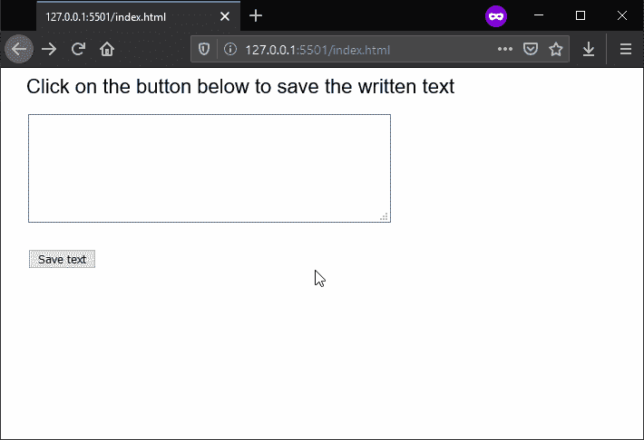
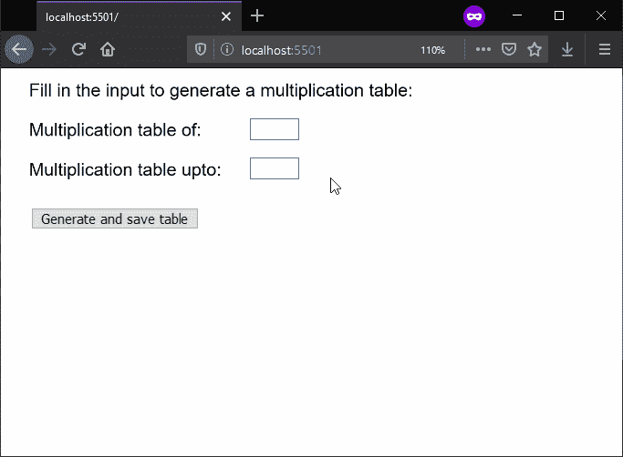

# p5.js | saveStrings()函数

> 原文:[https://www.geeksforgeeks.org/p5-js-savestrings-function/](https://www.geeksforgeeks.org/p5-js-savestrings-function/)

**saveStrings()函数**用于向文件中写入一个字符串数组，每个字符串一行。文件的保存将因网络浏览器而异。

**语法:**

```
saveStrings( list, filename, extension )
```

**参数:**该函数接受三个参数，如上所述，如下所述:

*   **列表:**是必须写入文件的字符串数组。
*   **文件名:**它指定用作保存文件文件名的字符串。
*   **扩展名:**指定用作保存文件扩展名的字符串。这是一个可选参数。

下面的例子说明了 p5.js 中的 **saveStrings()函数**:

**例 1:**

```
function setup() {
    createCanvas(600, 300);
    textSize(22);

    // Create a textarea for
    // the input of text
    inputArea = createElement('textarea');
    inputArea.position(30, 50)
    inputArea.size(400, 120);

    // Create a button for saving text
    saveBtn = createButton("Save text");
    saveBtn.position(30, 200)
    saveBtn.mousePressed(saveFile);
}

function draw() {
    clear();
    text("Click on the button below to "
        + "save the written text", 20, 20);
}

function saveFile() {

    // Get the value of the textarea
    // and split the strings on the basis
    // of the nextline character
    stringList = inputArea.value().split("\n");

    // Save the strings to file
    saveStrings(stringList, 'output.txt');
}
```

**输出:**


**例 2:**

```
function setup() {
    createCanvas(600, 300);
    textSize(18);

    // Create both inputs for the
    // multiplication table
    multiOf = createInput();
    multiOf.position(250, 50)
    multiOf.size(50);

    multiTo = createInput();
    multiTo.position(250, 90)
    multiTo.size(50);

    // Create a button for saving text
    saveBtn = createButton(
        "Generate and save table");
    saveBtn.position(30, 140)
    saveBtn.mousePressed(saveFile);
}

function draw() {
    clear();
    text("Fill in the input to generate "
        + "a multiplication table:", 20, 20);
    text("Multiplication table of:", 20, 60);
    text("Multiplication table upto:", 20, 100);
}

function saveFile() {

    // Get the value of the two inputs
    // and generate table
    let mul = multiOf.value();
    let maxUpto = multiTo.value();
    let stringList = [];

    for (let i = 0; i < maxUpto; i++) {
        stringList[i] = mul + " * "
            + i + " = " + mul * i;
    }

    // Save the strings to file
    saveStrings(stringList, 'output.txt');
}
```

**输出:**


**在线编辑:**[https://editor.p5js.org/](https://editor.p5js.org/)

**环境设置:**

**参考:**T2】https://p5js.org/reference/#/p5/saveStrings