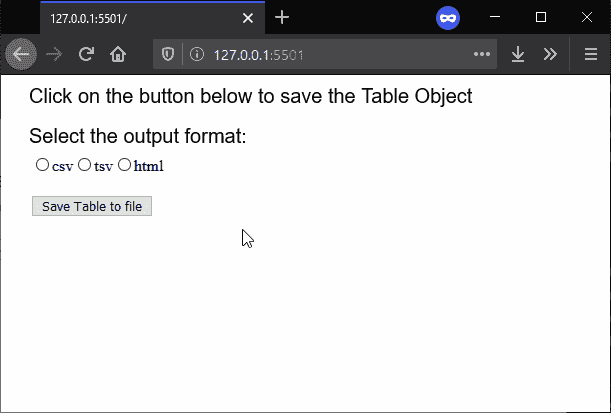

# p5.js | saveTable()功能

> 原文:[https://www.geeksforgeeks.org/p5-js-savetable-function/](https://www.geeksforgeeks.org/p5-js-savetable-function/)

**保存表格()功能**用于保存一个 p5。表对象转换为文件。保存的文件格式可以定义为函数的一个参数。默认情况下，它会保存一个带有逗号分隔值的文本文件，但是，它可以用于使用制表符分隔值保存文本文件，或者从中生成一个 HTML 表。

**语法:**

```
saveTable( Table, filename, options )
```

**参数:**该函数接受三个参数，如上所述，如下所述:

*   **表:**这是一个 p5。将保存到文件中的表对象。
*   **文件名:**它指定用作保存文件文件名的字符串。
*   **选项:**是表示要保存的表格格式的字符串。它可以是使用逗号分隔值保存表格的“csv”，使用制表符分隔值保存表格的“tsv”，或者生成 html 表格的“HTML”。这是一个可选参数。

下面的例子说明了 p5.js 中的 **saveTable()函数**:

**示例:**

```
function setup() {
  createCanvas(600, 300);
  textSize(20);

  text("Click on the button below to "
        + "save the Table Object", 20, 20);

  text("Select the output format:", 20, 60);

  // Create radio button for choosing
  // file format to save the table
  radio = createRadio();
  radio.position(30, 80);
  radio.option('csv');
  radio.option('tsv');
  radio.option('html');

  // Create a button for saving the Table object
  saveBtn = createButton("Save Table to file");
  saveBtn.position(30, 120);
  saveBtn.mousePressed(saveFile);

  // Create the table for saving to file
  table = new p5.Table();

  table.addColumn('Invention');
  table.addColumn('Inventors');

  let tableRow = table.addRow();
  tableRow.setString('Invention', 'Telescope');
  tableRow.setString('Inventors', 'Galileo');

  tableRow = table.addRow();
  tableRow.setString('Invention', 'Steam Engine');
  tableRow.setString('Inventors', 'James Watt');

  tableRow = table.addRow();
  tableRow.setString('Invention', 'Radio');
  tableRow.setString('Inventors', 'Guglielmo Marconi');
}

function saveFile() {

  // Get the output format selected
  // from the radio buttons
  outputFormat = radio.value();

  // Save the table to file with the given format
  saveTable(table, 'tableOutput', outputFormat);
}
```

**输出:**


**在线编辑:**[https://editor.p5js.org/](https://editor.p5js.org/)

**环境设置:**

**参考:**T2】https://p5js.org/reference/#/p5/saveTable