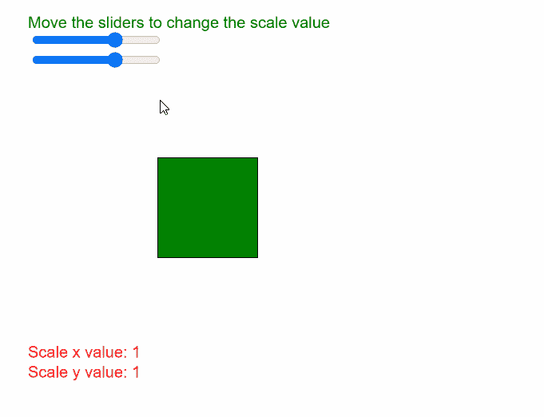
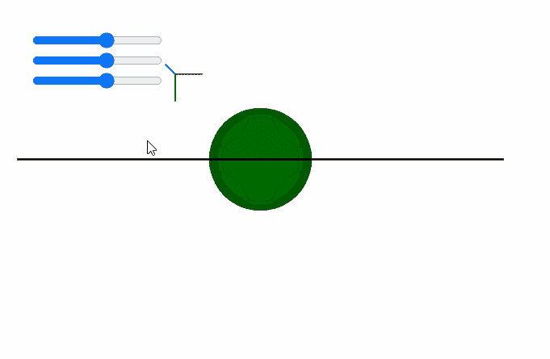

# p5.js | scale()函数

> 原文:[https://www.geeksforgeeks.org/p5-js-scale-function/](https://www.geeksforgeeks.org/p5-js-scale-function/)

p5.js 中的 **scale()函数**用于通过扩展或收缩形状或模型的顶点来增加或减小其大小。比例值被指定为十进制百分比，也就是说，比例值“2.0”会将形状的尺寸增加 200%。类似地，负值“-2.0”会将形状的尺寸减小 200%

对象总是从其相对原点缩放到坐标系。此函数的 z 参数仅在 WebGL 模式下可用于在 z 轴上缩放。

由于`scale()`是一个变换，一次调用后发生的每一次变换都会使效果倍增。如果在`draw()`循环中调用`scale()`，那么当循环再次开始时，变换被重置。

**语法:**

```
scale( s, [y], [z] )
```

运筹学

```
scale( scales )
```

**参数:**该功能接受四个参数，如上所述，如下所述。

*   **s:** 是 p5。定义缩放对象的百分比的向量、数字或数字数组。如果给定多个参数，它表示在 x 方向上缩放对象的百分比。
*   **y:** 它是一个数字，表示在 y 方向上缩放对象的百分比。这是一个可选参数。
*   **z:** 它是一个数字，表示在 z 方向上缩放对象的百分比。这是一个可选参数。
*   **刻度:**是 p5。指定按轴百分比缩放对象的向量或数字数组。

下面的程序说明了 p5.js 中的**刻度()**功能:

**例 1:**

```
function setup() {
  createCanvas(500, 400);
  textSize(16);

  scaleXslider = createSlider(-3, 3, 1, 0.1);
  scaleXslider.position(30, 30);

  scaleYslider = createSlider(-3, 3, 1, 0.1);
  scaleYslider.position(30, 50);
}

function draw() {
  clear();
  text("Move the sliders to change the scale value", 20, 20);
  fill("red");
  rect(150, 150, 100, 100);

  // Get the scale parameters
  let scaleXValue = scaleXslider.value();
  let scaleYValue = scaleYslider.value();

  text("Scale x value: " + scaleXValue, 20, 350);
  text("Scale y value: " + scaleYValue, 20, 370);

  // Set the scale according to properties
  scale(scaleXValue, scaleYValue);

  fill("green");
  rect(150, 150, 100, 100);
}
```

**输出:**



**例 2:**

```
function preload() {
  ballObj = loadModel("models/ball.obj", true);
}

function setup() {
  createCanvas(500, 300, WEBGL);

  scaleXslider = createSlider(-3, 3, 0.5, 0.1);
  scaleXslider.position(30, 30);

  scaleYslider = createSlider(-3, 3, 0.5, 0.1);
  scaleYslider.position(30, 50);

  scaleZslider = createSlider(-3, 3, 0.5, 0.1);
  scaleZslider.position(30, 70);

  debugMode();
}

function draw() {
  clear();
  noStroke();
  lights();
  orbitControl();

  // Get the scale parameters
  let scaleXValue = scaleXslider.value();
  let scaleYValue = scaleYslider.value();
  let scaleZValue = scaleZslider.value();

  // Set the scale according to properties
  scale(scaleXValue, scaleYValue, scaleZValue);

  fill("green")
  model(ballObj);
}
```

**输出:**



**参考:**T2】https://p5js.org/reference/#/p5/scale