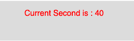

# p5.js | second()功能

> 原文:[https://www.geeksforgeeks.org/p5-js-second-function/](https://www.geeksforgeeks.org/p5-js-second-function/)

p5.js 中的**秒()功能**用于返回系统时钟的当前秒。second()函数的值介于 0 到 59 之间。

**语法:**

```
second()
```

**参数:**函数不接受任何参数。

**返回值:**该函数返回一个代表当前秒的整数值。

下面的程序说明了 p5.js 中的第二个()函数:

**示例:**本示例使用 second()函数返回当前秒。

```
function setup() {

    // Create Canvas of size 270*80
    createCanvas(270, 80);
}

function draw() {

    // Set the background color
    background(220);

    // Store value of second() function
    // to the variable
    let s = second();

    // Set the font size
    textSize(16);

    // Set the font color
    fill(color('red'));

    // Display result 
    text("Current Second is : " + s, 50, 30);
}
```

**输出:**


**参考:**T2】https://p5js.org/reference/#/p5/second