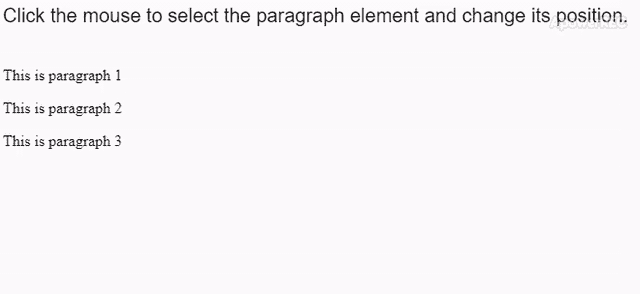
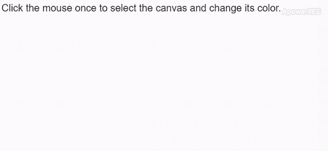

# p5.js | select()函数

> 原文:[https://www.geeksforgeeks.org/p5-js-select-function/](https://www.geeksforgeeks.org/p5-js-select-function/)

**select()** 函数用于搜索页面中具有给定 id、类或标记名的元素，并将其作为 p5.element 返回，其语法类似于 CSS 选择器。有一个可选参数可用于在给定元素中进行搜索。如果页面上存在多个与选择器匹配的元素，则此方法仅返回第一个元素。

**注意:**可以使用**访问元素的 DOM 节点。elt** 属性。

**语法:**

```
select(name, [container])
```

**参数:**该函数接受两个参数，如上所述，如下所述:

*   **名称:**是一个字符串，表示需要搜索的元素的 id、类或标签名。
*   **容器:**这是一个可选参数，表示要搜索的元素。

**返回值:**当给定元素被成功找到时，它返回一个包含该节点的 p5.element。否则，它返回 null。

以下示例说明了 p5.js 中的 **select()** 功能:

**例 1:**

```
function setup() {
  createCanvas(650, 50);
  textSize(20);
  text("Click the mouse to select the paragraph" +
       " element and change its position.", 0, 20);

  para1 = createP("This is paragraph 1");
  para2 = createP("This is paragraph 2");
  para3 = createP("This is paragraph 3");
}

function mouseClicked() {

  // Select the first
  // paragraph element
  selectedP = select("p");

  // Change position to 200, 20
  selectedP.position(200, 20);
}
```

**输出:**


**例 2:**

```
function setup() {
  createCanvas(650, 300);
  textSize(20);
  text("Click the mouse once to select the"+
       " canvas and change its color.", 0, 20);

}

function mouseClicked() {

  // Select the first
  // canvas element
  selectedCanvas = select("canvas");

  // Get the DOM node using .elt and
  // change background color to green
  selectedCanvas.elt.style.backgroundColor
        = "green";
}
```

**输出:**


**在线编辑:**[https://editor.p5js.org/](https://editor.p5js.org/)

**环境设置:**

**参考:**T2】https://p5js.org/reference/#/p5/select