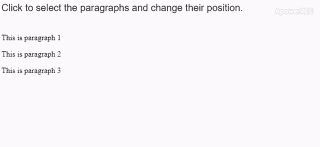

# p5.js | selectAll()功能

> 原文:[https://www.geeksforgeeks.org/p5-js-selectall-function/](https://www.geeksforgeeks.org/p5-js-selectall-function/)

**selectAll()** 函数用于搜索具有给定 id、类或标签名的元素，并将其作为 p5 返回。元素数组。它的语法类似于 CSS 选择器。有一个可选参数可用于在给定元素中进行搜索。此方法返回页面上存在的所有元素，并匹配选择器。

**语法:**

```
selectAll(name, [container])
```

**参数:**该函数接受两个参数，如上所述，如下所述:

*   **名称:**这是一个字符串，表示要搜索的元素的 id、类或标签名。
*   **容器:**这是一个可选参数，表示要在其中搜索的元素。

**返回:**返回 p5。包含所有匹配元素的元素数组。

下面的例子说明了 p5.js 中的 **selectAll()** 功能:

**示例:**

```
function setup() {
  createCanvas(600, 50);
  textSize(20);
  text("Click to select the paragraphs"+
       " and change their position.", 0, 20);

  para1 = createP("This is paragraph 1");
  para2 = createP("This is paragraph 2");
  para3 = createP("This is paragraph 3");
}

function mouseClicked() {

  // Select all the
  // paragraph elements
  selectedParas = selectAll("p");

  // Loop through each of them
  for (i = 0; i < selectedParas.length; i++) {

    // Change the position of
    // of the elements
    selectedParas[i].position(100, 100 + i * 25);
  }
}
```

**输出:**


**在线编辑:**[https://editor.p5js.org/](https://editor.p5js.org/)

**环境设置:**

**参考:**T2】https://p5js.org/reference/#/p5/selectall