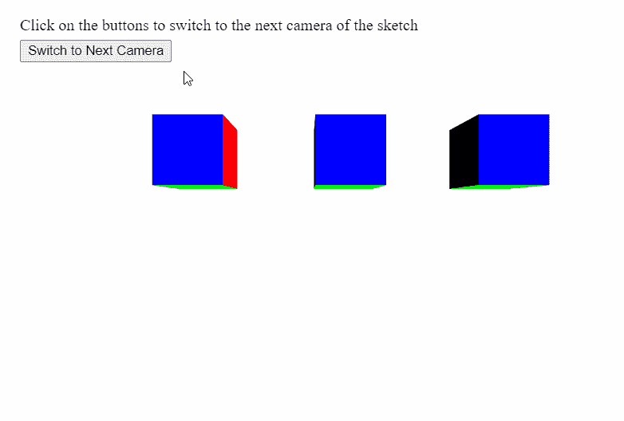

# p5.js | setCamera()功能

> 原文:[https://www.geeksforgeeks.org/p5-js-setcamera-function/](https://www.geeksforgeeks.org/p5-js-setcamera-function/)

p5.js 中的 **setCamera()功能**用于将渲染器的当前摄像机设置为给定的 p5。相机对象。这可用于切换到多个摄像机。

**语法:**

```
setCamera( cam )

```

**参数:**该函数接受如上所述的单个参数，如下所述:

*   **cam:** 是 p5。该功能将摄像机更改为的摄像机对象。

下面的例子说明了 p5.js 中的 **setCamera()函数**:
**例子:**

## java 描述语言

```
let cameras = [];
let currCameraIndex = 0;

function setup() {
  createCanvas(600, 400, WEBGL);
  helpText = createP(
    "Click on the buttons to switch to the"+
    " next camera of the sketch"
  );
  helpText.position(20, 0);

  // Button to switch to the next camera
  // in the scene
  newCameraBtn = createButton("Switch to Next Camera");
  newCameraBtn.position(20, 40);
  newCameraBtn.mouseClicked(switchActiveCamera);

  // Create 5 cameras and store into array
  for (let i = 0; i < 5; i++) {
    cameras[i] = createCamera();

    // Randomly set the position the camera
    // is looking at using setPosition()
    randomX = floor(random(-100, 100));
    randomY = floor(random(-100, 100));

    cameras[i].setPosition(randomX, randomY, 350);
  }
}

function switchActiveCamera() {
  // Increment the camera index
  if (currCameraIndex < 4) currCameraIndex += 1;
  else currCameraIndex = 0;

  // Set the camera from the camera array
  // to that index
  setCamera(cameras[currCameraIndex]);
}

function draw() {
  clear();
  orbitControl();
  normalMaterial();

  // Create three boxes at three positions
  translate(-150, 0);
  box(65);
  translate(150, 0);
  box(65);
  translate(150, 0);
  box(65);
}
```

**输出:**



**在线编辑:**[【https://editor.p5js.org/】](https://editor.p5js.org/)
**环境设置:**[https://www . geeksforgeeks . org/P5-js-soundfile-object-installation-and-methods/](https://www.geeksforgeeks.org/p5-js-soundfile-object-installation-and-methods/)
**参考:**[https://p5js.org/reference/#/p5/setCamera](https://p5js.org/reference/#/p5/setCamera)