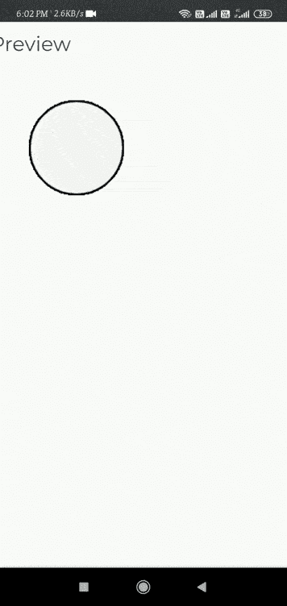

# p5.js setMoveThreshold()函数

> 原文:[https://www . geesforgeks . org/P5-js-setmovethreshold-function/](https://www.geeksforgeeks.org/p5-js-setmovethreshold-function/)

功能**设置移动阈值()**用于设置设备移动()功能的**移动阈值。默认阈值设置为 **0.5** 。**

**语法:**

```
setMoveThreshold(value)
```

**参数:**该函数接受一个参数，如上所述，如下所述。

*   **值:**是表示阈值的数字。

**示例:**

## java 描述语言

```
// Run this example on a mobile device
// You will need to move the device incrementally further

let value = 0;
let threshold = 0.5;
function setup() {

// The function in which we pass the threshold value as default.
  setMoveThreshold(threshold);
}
function draw() {
  fill(value);
 ellipse(56, 46, 55, 55);
}
function deviceMoved() {
  value = value + 7;

  // increment in the threshold.
  threshold = threshold + 0.1;
  if (value > 255) {
    value = 0;
    threshold = 30;
  }
  //Again set the threshold function.
  setMoveThreshold(threshold);
}
```

**输出:**



**参考:**T2】https://p5js.org/reference/#/p5/setMoveThreshold