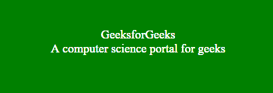

# p5.js | setup()功能

> 原文:[https://www.geeksforgeeks.org/p5-js-setup-function/](https://www.geeksforgeeks.org/p5-js-setup-function/)

setup()函数在程序启动时运行。它用于设置初始环境属性，如文本颜色、屏幕大小、背景颜色，并加载媒体文件，如图像和字体。该程序只包含一个 setup()函数。setup()函数在首次执行后不能再次调用。

**注意:【setup()函数内的变量声明不能被包括 draw()函数在内的其他函数访问。**

**语法:**

```
setup()
```

下面的例子说明了 p5.js 中的 setup()函数:

**例 1:**

```
function setup() { 

    // Create Canvas of given size 
    createCanvas(400, 300); 

} 

function draw() { 

    background(220); 

    // Use color() function 
    let c = color('green'); 

    // Use fill() function to fill color 
    fill(c); 

    // Draw a rectangle 
    rect(50, 50, 300, 200); 

} 
```

**输出:**


**例 2:**

```
function setup() {  

    // Create Canvas of given size 
    var cvs = createCanvas(600, 250);
}

function draw() {

    // Set the background color
    background('green'); 

    // Use createDiv() function to
    // create a div element
    var myDiv = createDiv('GeeksforGeeks');

    var myDiv1 = createDiv('A computer science portal for geeks');

    // Use child() function
    myDiv.child(myDiv1);

    // Set the position of div element
    myDiv.position(150, 100);  

    myDiv.style('text-align', 'center');

    // Set the font-size of text
    myDiv.style('font-size', '24px');

    // Set the font color
    myDiv.style('color', 'white');

}
```

**输出:**
