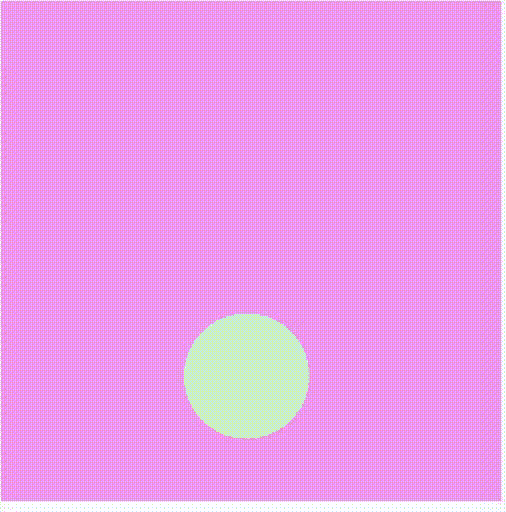

# p5.js 着色器()方法

> 原文:[https://www.geeksforgeeks.org/p5-js-shader-method/](https://www.geeksforgeeks.org/p5-js-shader-method/)

p5.js 中的**着色器()函数**使得在 WEBGL 模式下使用自定义着色器填充形状成为可能。可以使用 loadShader()方法加载自定义着色器，甚至可以对其进行编程以在其上移动图形。

**语法:**

```
shader( [s] )
```

**参数:**该函数有一个参数，如上所述，讨论如下:

*   **s:** 是 p5。包含用于填充形状的所需着色器的着色器对象。

下面的例子演示了 p5.js 中的**着色器()函数**:

**示例:**本示例展示了如何使用着色器绘制圆。

## java 描述语言

```
// Variable to hold the shader object
let circleShader;

function preload() {

  // Load the shader files with loadShader()
  circleShader = loadShader('basic.vert', 'basic.frag');
}

function setup() {
  // Shaders require WEBGL mode to work
  createCanvas(400, 400, WEBGL);
  noStroke();
}

function draw() {  
  // The shader() function sets the active
  // shader with our shader
  shader(circleShader);

  // Setting the time and resolution of our shader
  circleShader.setUniform(
    'resolution', [width, height]
  );
  circleShader.setUniform(
    'time', frameCount * 0.05
  );

  // Using rect() to give some 
  // geometry on the screen
  rect(0, 0, width, height);
}

function windowResized() {
  resizeCanvas(windowWidth, windowHeight);
}
```

**基本。绿色**

```
attribute vec3 aPosition;
attribute vec2 aTexCoord;

void main() {

 // Copy the position data into a vec4,
 // using 1.0 as the w component
 vec4 positionVec4 = vec4(aPosition, 1.0);

 // Scale the rect by two, and move it to
 // the center of the screen
 positionVec4.xy = positionVec4.xy * 2.0 - 1.0;

 // Send the vertex information on to
 // the fragment shader
 gl_Position = positionVec4;
}
```

**基本片段**

```
precision mediump float;

varying vec2 vTexCoord;

// We need the sketch resolution to
// perform some calculations
uniform vec2 resolution;
uniform float time;

// Function that turns an rgb value that
// goes from 0 - 255 into 0.0 - 1.0
vec3 rgb(float r, float g, float b){
  return vec3(r / 255.0, g / 255.0, b / 255.0);
}

vec4 circle(float x, float y, float diam, vec3 col){
    vec2 coord = gl_FragCoord.xy;
    // Flip the y coordinates for p5
    coord.y = resolution.y - coord.y;

    // Store the x and y in a vec2 
    vec2 p = vec2(x, y);

    // Calculate the circle
    // First get the difference of the circles 
    // location and the screen coordinates
    // compute the length of that result and 
    // subtract the radius
    // this creates a black and white mask that 
    // we can use to multiply against our colors
    float c = length( p - coord) - diam*0.5;

    // Restrict the results to be between 
    // 0.0 and 1.0
    c = clamp(c, 0.0,1.0);

    // Send out the color, with the circle
    // as the alpha channel  
    return vec4(rgb(col.r, col.g, col.b), 1.0 - c);  
}

void main() {

  // The width and height of our rectangle
  float width = 100.0;
  float height = 200.0;

  // the center of the screen is just the
  // resolution divided in half
  vec2 center = resolution * 0.5;

  // Lets make our rect in the center of the
  // screen. We have to subtract half of it's
  // width and height just like in p5
  float x = center.x ;
  float y = center.y ;

  // add an oscillation to x

  x += sin(time) * 200.0;

  // A color for the rect 
  vec3 grn = vec3(200.0, 240.0, 200.0);

  // A color for the bg
  vec3 magenta = rgb(240.0,150.0,240.0);

  // Call our circle function
  vec4 circ = circle(x, y, 200.0, grn);
  // out put the final image

  // Mix the circle with the background color
  // using the circles alpha
  circ.rgb = mix(magenta, circ.rgb, circ.a);

  gl_FragColor = vec4( circ.rgb ,1.0);
}
```

**输出:**



**参考:**T2】https://p5js.org/reference/#/p5/shader