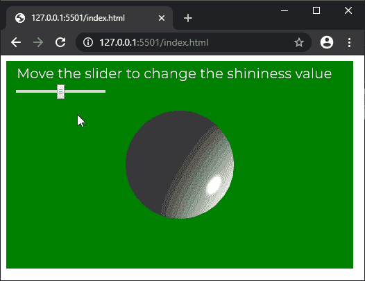

# P5 . js | shiny()功能

> 原文:[https://www.geeksforgeeks.org/p5-js-shininess-function/](https://www.geeksforgeeks.org/p5-js-shininess-function/)

p5.js 中的**光泽()功能**用于指定形状表面的光泽度。与**镜面材质()功能**结合使用，设置材质属性。

**语法:**

```
shininess( shine )
```

**参数:**该函数接受一个参数，如上所述，如下所述。

*   **闪耀:**是一个数字，指定一个元素的闪耀程度。默认值为 1。

下面的例子说明了 p5.js 中的**闪亮()功能**:

**示例:**

```
let newFont;

function preload() {
  newFont = loadFont('fonts/Montserrat.otf');
}

function setup() {
  createCanvas(500, 300, WEBGL);
  shineInput = createSlider(0, 100, 50, 1);
  shineInput.position(20, 40);
  textFont(newFont);
  textSize(20);
}

function draw() {
  background('green');
  text("Move the slider to change the shininess value", -235, -125);
  noStroke();
  ambientLight(60, 60, 60);
  pointLight(255, 255, 255, width / 2, height / 2, 75);
  specularMaterial(250);
  shininess(shineInput.value());

  sphere(75);
}
```

**输出:**


**在线编辑:**[https://editor.p5js.org/](https://editor.p5js.org/)

**环境设置:**

**参考:**T2】https://p5js.org/reference/#/p5/shininess