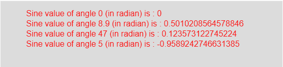

# p5.js | sin()功能

> 原文:[https://www.geeksforgeeks.org/p5-js-sin-function/](https://www.geeksforgeeks.org/p5-js-sin-function/)

p5.js 中的 **sin()函数**用于计算作为函数输入参数的弧度角的正弦值，给出-1 到 1 之间的结果。

**语法:**

```
sin( angle )
```

**参数:**该函数接受单个参数**角度**，这是一个以弧度为单位的角度，其正弦值被计算。

**返回值:**返回作为输入参数的弧度角的正弦值。

下面的程序说明了 p5.js 中的 sin()函数:

**示例:**本示例使用 sin()函数获取角度的正弦值，单位为弧度。

```
function setup() { 

    // Create Canvas of size 270*80 
    createCanvas(550, 130); 
} 

function draw() { 

    // Set the background color 
    background(220); 

    // Initialize the parameter with
    // angles in radian only
    let a = 0; 
    let b = 8.9; 
    let c = 47;
    let d = 5;

    // Call to sin() function 
    let v = sin(a);
    let w = sin(b);
    let x = sin(c);
    let y = sin(d);

    // Set the size of text 
    textSize(16); 

    // Set the text color 
    fill(color('red')); 

    // Getting sine value 
    text("Sine value of angle 0 (in radian) is : " + v, 50, 30);
    text("Sine value of angle 8.9 (in radian) is : " + w, 50, 50);
    text("Sine value of angle 47 (in radian) is : " + x, 50, 70);
    text("Sine value of angle 5 (in radian) is : " + y, 50, 90);     
} 
```

**产量:**


**注意:**在上面的代码中，输入角度应以弧度为单位。要将度数转换为弧度，请使用以下公式:

```
Angles_in_radian = (π/180)*angles_in_degree
```

**参考:**T2】https://p5js.org/reference/#/p5/sin