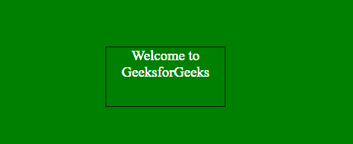

# p5.js | size()功能

> 原文:[https://www.geeksforgeeks.org/p5-js-size-function/](https://www.geeksforgeeks.org/p5-js-size-function/)

**尺寸()功能**是一个内置功能，用于设置元素的宽度和高度。自动用于一次设置一个尺寸。如果没有给出 size()函数的参数，则返回对象中元素的宽度和高度。

这个函数需要 p5.dom 库。所以在**index.html**文件的头部增加下面一行。

```
<script language="javascript"
    type="text/javascript" src="path/to/p5.dom.js">
</script>
```

**语法:**

```
size()
```

或者

```
size( w, h )
```

**参数:**该函数接受两个参数，如上所述，如下所述:

*   **w:** 此参数保存元素的宽度，可以是 AUTO，也可以是一个数字。
*   **h:** 此参数保存元素的高度，可以是 AUTO，也可以是一个数字。

**返回值:**该函数返回对象中元素的宽度和高度。

下面的例子说明了 p5.js 中的 size()函数:

**示例:**

```
function setup() {  

    // Create Canvas of given size 
    var cvs = createCanvas(600, 250);
}

function draw() {

  // Set the background color
  background('green'); 

  // Use createDiv() function to
  // create a div element
  var myDiv = createDiv('Welcome to GeeksforGeeks');

  // Set the position of div element
  myDiv.position(180, 80);  

  // Set the div size
  myDiv.size(200, 100);

  // Set the font-size of text
  myDiv.style('font-size', '24px');

  // Set the font-size of text
  myDiv.style('border', '1px solid black');

  // Set the font-size of text
  myDiv.style('text-align', 'center');

  // Set the font color
  myDiv.style('color', 'white');

}
```

**输出:**
