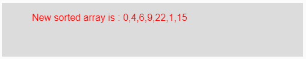

# p5.js | sort()功能

> 原文:[https://www.geeksforgeeks.org/p5-js-sort-function/](https://www.geeksforgeeks.org/p5-js-sort-function/)

p5.js 中的 **sort()函数**用于对数组元素进行排序。如果数组元素是字符串，则按字母顺序排序；如果数组元素是整数，则按升序排序。

**语法:**

```
sort(Array, Count)
```

**参数:**该函数接受两个参数，如上所述，如下所述:

*   **数组:**此参数保存要排序的数组元素。
*   **计数:**保存需要排序的元素个数。这应该小于数组的长度。

**返回值:**返回一个新的排序数组。

下面的程序说明了 p5.js 中的 sort()函数:

**示例 1:** 本示例使用 sort()函数对数组元素进行排序。

```
function setup() { 

    // Creating Canvas size
    createCanvas(500, 90); 
} 

function draw() { 

    // Set the background color 
    background(220); 

    // Initializing the array
    let Array = ['IT', 'CSE', 'ECE', 'CIVIL'];

    // Initializing the Count which says
    // the number of elements to be sorted
    // from starting
    let Count = 3;

    // Calling to sort() function.
    let A = sort(Array, Count);

    // Set the size of text 
    textSize(16); 

    // Set the text color 
    fill(color('red')); 

    // Getting new sorted array
    text("New sorted array is : " + A, 50, 30);

} 
```

**输出:**


**示例 2:** 本示例使用 sort()函数对数组元素进行排序。

```
function setup() { 

    // Creating Canvas size
    createCanvas(500, 90); 
} 

function draw() { 

    // Set the background color 
    background(220); 

    // Initializing the array
    let Array = ['IT', 'CSE', 'ECE', 'CIVIL'];

    // Initializing the Count which says
    // the number of elements to be sorted
    // from starting
    let Count = 4;

    // Calling to sort() function.
    let A = sort(Array, Count);

    // Set the size of text 
    textSize(16); 

    // Set the text color 
    fill(color('red')); 

    // Getting new sorted array
    text("New sorted array is : " + A, 50, 30);           
} 
```

**输出:**


**示例 3:** 本示例使用 sort()函数对数组元素进行排序。

```
function setup() { 

    // Creating Canvas size
    createCanvas(500, 90); 
} 

function draw() { 

    // Set the background color 
    background(220); 

    // Initializing the array
    let Array = [9, 6, 0, 22, 4, 1, 15];

    // Initializing the Count which says
    // the number of elements to be sorted
    // from starting
    let Count = 5;

    // Calling to sort() function.
    let A = sort(Array, Count);

    // Set the size of text 
    textSize(16); 

    // Set the text color 
    fill(color('red')); 

    // Getting new sorted array
    text("New sorted array is : " + A, 50, 30);

} 
```

**输出:**


**参考:**T2】https://p5js.org/reference/#/p5/sort