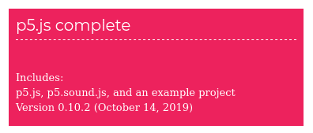
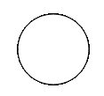

# p5.js | SoundFile 对象安装及方法

> 原文:[https://www . geesforgeks . org/P5-js-sound file-object-installation-and-methods/](https://www.geeksforgeeks.org/p5-js-soundfile-object-installation-and-methods/)

**声音文件对象**是 p5.sound 的一部分，P5 . sound 是一个 JavaScript 库。这个对象包含如此多的功能，有将近 30 多个功能。他们每个人都有助于设计一个听起来不错的网站。通过使用此对象，您可以轻松地将音频添加到您的网站，并播放、暂停、停止您想要的任何内容。为此，您只需要在索引文件中附加声音库。为了做到这一点，我们将遵循下面提到的一些程序一个接一个。

*   **第一步:**首先你要下载 p5。声音库来自这个[链接](https://p5js.org/download/)，打开这个链接后进入 p5.js 完整章节如下。



*   **第二步:**下载完文件后，你必须解压文件夹，然后你会在 p5.js 文件夹中找到一些文件，比如**index.html**、 **sketch.js** 打开 index.html 文件，你会看到 p5.js 已经链接到它了，你可以通过用下面的脚本替换那个脚本来提高性能。

示例网页可能如下所示:

## 超文本标记语言

```
<!DOCTYPE html>
<html>
    <head>
        <script src=”../p5.min.js”></script>
        <script src="sketch.js"></script>
    </head>

    <body>
    </body>
</html>
```

*   **第三步:**在这一步中，我们将为 p5.js 设置代码编辑器，在我看来，最好的代码编辑器是**括号**、 **Atom** 。但是你也可以用其他的，像记事本++，威震等。
*   **第四步:**现在打开编辑器，追踪到你的 p5.js 文件夹位置，打开 **sketch.js** 文件。在这个文件中，我们将执行任务，这里我们将编写我们的脚本来测试这个库，并在我们的网站上使用它们。
*   **第五步:**在这一步中，你将了解如何使用它。

## java 描述语言

```
function setup() {

}

function draw() {
  ellipse(50, 50, 80, 80);
}
```

你会得到这样的信息:



**列出所有功能 p5。sound file:**

<figure class="table">

| function | explain |
| --- | --- |
| [loadSound()](https://www.geeksforgeeks.org/p5-js-loadsound-function/) | This function is used to load sound. |
| [已加载()](https://www.geeksforgeeks.org/p5-js-isloaded-function/) | This function is used to check whether the sound is loaded. |
| [Play ()](https://www.geeksforgeeks.org/p5-js-play-function/) | This function is used to play the loaded sound. |
| [播放模式()](https://www.geeksforgeeks.org/p5-js-playmode-function/) | This function is used to restart and sustain sound in two playback modes. |
| [Pause ()](https://www.geeksforgeeks.org/p5-js-pause-function/) | This function is used to pause the played sound. |
| [Cycle ()](https://www.geeksforgeeks.org/p5-js-loop-function-2/) | This function is used to create the loop of that sound. |
| [正在循环()](https://www.geeksforgeeks.org/p5-js-islooping-function/) | This function is used to check whether the loop function is called or not. |
| [【setloop()](https://www.geeksforgeeks.org/p5-js-setloop-function/) | This function is used to create cycle definition times. |
| [isPlaying()](https://www.geeksforgeeks.org/p5-js-isplaying-function/) | This function is used to check whether audio is playing. |
| [isPaused()](https://www.geeksforgeeks.org/p5-js-ispaused-function/) | This function is used to check whether audio is paused. |
| [停止()](https://www.geeksforgeeks.org/p5-js-stop-function/) | This function is used to stop playing audio. |
| 七卷() | This function is used to set the volume of the audio range from 0 to 1. |
| [pan ()](https://www.geeksforgeeks.org/p5-js-pan-function/) | This function is used to set the left and right pan of the audio range to -1 (left) to 1 (right). |
| [get an()](https://www.geeksforgeeks.org/p5-js-getpan-function/) | This function is used to check the pan side. |
| [Rate ()](https://www.geeksforgeeks.org/p5-js-rate-function/) | This function is used to set the playback speed of audio. |
| [Duration ()](https://www.geeksforgeeks.org/p5-js-duration-function/) | This function is used to obtain the duration of audio. |
| [当前时间()](https://www.geeksforgeeks.org/p5-js-currenttime-function/) | This function is used to obtain the current time of the audio being played. |
| [Jump ()](https://www.geeksforgeeks.org/p5-js-jump-function/) | This function is used to jump at a specific point in the audio. |
| [Channel ()](https://www.geeksforgeeks.org/p5-js-channels-function/) | This function is used to obtain channel mono means 1 stereo means 2. |
| [采样率()](https://www.geeksforgeeks.org/p5-js-samplerate-function/) | This function is used to obtain the sampling rate of audio per second. |
| [Frame number ()](https://www.geeksforgeeks.org/p5-js-frames-function/) | This function is used to obtain the frame number of audio, where the frame number = samplesrate * duration. |
| get eaks() | This function is used to obtain an array of amplitude peaks of audio. |
| [反向缓冲()](https://www.geeksforgeeks.org/p5-js-reversebuffer-function/) | This function is used to play audio in reverse. |
| [onended()](https://www.geeksforgeeks.org/p5-js-onended-function/) | This function is used to call the event after the audio is finished. |
| 连接() | This function is used to connect the output of one p5sound object to the input of another p5.sound object. |
| 断开连接() | This function is used to disconnect the output of this p5sound object. |
| setPath() | This function is used to set the audio path. |
| setBuffer() | This function is used to set the buffer for audio. |
| processPeaks() | This function is used to get the beat of audio. |
| [add()](https://www.geeksforgeeks.org/p5-js-addcue-function/) | This function is used to add events after the specified time. |
| [移除提示()](https://www.geeksforgeeks.org/p5-js-removecue-function/) | This function is used to delete specific events scheduled by the addCue function. |
| [清晰提示()](https://www.geeksforgeeks.org/p5-js-clearcues-function/) | This function is to clear all events scheduled by the addCue function. |
| preserve | This function is used to save audio locally. |
| getBlob() | This function is used to upload audio from the server. |

</figure>