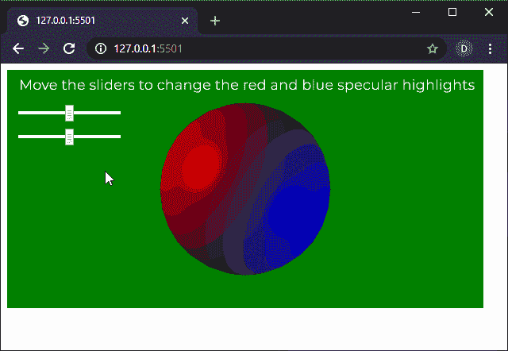

# P5 . js | mirrorcolor()函数

> 原文:[https://www.geeksforgeeks.org/p5-js-specularcolor-function/](https://www.geeksforgeeks.org/p5-js-specularcolor-function/)

p5.js 中的**mirrorcolor()函数**用于设置镜面高光在与镜面材质和高光一起使用时的颜色。

该方法通常与镜面材质()和光泽()函数一起使用来定义镜面高光。如果没有镜象材料()函数，这个函数就没有效果。如果不使用此功能，默认的高光颜色是白色。

**语法:**

```
specularColor( v1, v2, v3 )
```

运筹学

```
specularColor( value )
```

运筹学

```
specularColor( gray )
```

运筹学

```
specularColor( values )
```

运筹学

```
specularColor( color )
```

**参数:**该功能接受 7 个参数，如上所述，描述如下:

*   **v1:** 是决定相对于当前颜色范围的红色或色相值的数字。
*   **v2:** 是决定相对于当前颜色范围的绿色或饱和度值的数字。
*   **v3:** 是决定相对于当前颜色范围的蓝色或亮度值的数字。
*   **值:**是定义高光颜色的字符串。
*   **灰度:**是定义镜面高光灰度值的数字。
*   **值:**它是一个数字数组，定义了高光颜色的红色、绿色、蓝色和 alpha 分量。
*   **颜色:**是 p5。定义高光颜色的颜色。

下面的例子说明了 p5.js 中的**镜象颜色()函数**:

**示例:**

```
let newFont;

function preload() {
  newFont = loadFont('fonts/Montserrat.otf');
}

function setup() {
  createCanvas(600, 300, WEBGL);
  textFont(newFont, 18);

  redColorSlider = createSlider(0, 255, 128, 1);
  redColorSlider.position(20, 50);

  blueColorSlider = createSlider(0, 255, 128, 1);
  blueColorSlider.position(20, 80);
}

function draw() {
  background('green');
  text("Move the sliders to change the red and"
    + " blue specular highlights", -285, -125);
  noStroke();
  shininess(15);

  redSpecularIntensity = redColorSlider.value();
  blueSpecularIntensity = blueColorSlider.value();

  specularColor(redSpecularIntensity, 0, 0);
  pointLight(255, 0, 0, -width / 2, -height / 2, 250);
  specularColor(0, 0, blueSpecularIntensity);
  pointLight(0, 0, 255, width / 2, height / 2, 250);

  specularMaterial(250);
  sphere(100);
}
```

**输出:**


**在线编辑:**[https://editor.p5js.org/](https://editor.p5js.org/)

**环境设置:**

**参考:**T2】https://p5js.org/reference/#/p5/specularColor