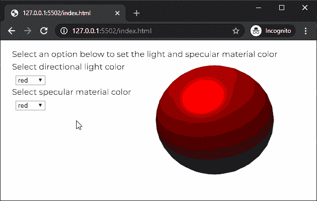

# p5.js |镜面材料()功能

> 原文:[https://www . geesforgeks . org/P5-js-mirrormaterial-function/](https://www.geeksforgeeks.org/p5-js-specularmaterial-function/)

p5.js 中的**镜面材质()函数**用于为给定颜色的几何图形创建镜面材质。镜面材料是有光泽的反射材料。它还定义了对象将反射的颜色。如果镜面材质设置为仅反射红色，那么它将仅反射红色，否则对象将不会反射任何其他颜色的光。

**语法:**

```
specularMaterial( v1, [v2], [v3] )
```

运筹学

```
specularMaterial( color )
```

**参数:**该函数接受四个参数，如上所述，如下所述:

*   **v1:** 是决定灰度值，或者相对于当前颜色范围的红色或色相值的数字。
*   **v2:** 是决定相对于当前颜色范围的绿色或饱和度值的数字。这是一个可选参数。
*   **v3:** 是决定相对于当前颜色范围的蓝色或亮度值的数字。这是一个可选参数。
*   **颜色:**是 p5。定义镜面材质颜色的颜色或颜色字符串。

下面的例子说明了 p5.js 中的 **directionalLight()函数**:

**示例:**

```
let newFont;
let currentLightColor = "red";
let currentSpecularColor = "red";

function preload() {
  newFont = loadFont('fonts/Montserrat.otf');
}

function setup() {
  createCanvas(600, 300, WEBGL);
  textFont(newFont, 16);

  materialColorSel = createSelect();
  materialColorSel.position(30, 70);
  materialColorSel.option('red');
  materialColorSel.option('green');
  materialColorSel.option('blue');
  materialColorSel.changed(() => {
    currentSpecularColor = materialColorSel.value();
  });

  lightColorSel = createSelect();
  lightColorSel.position(30, 120);
  lightColorSel.option('red');
  lightColorSel.option('green');
  lightColorSel.option('blue');
  lightColorSel.changed(() => {
    currentLightColor = lightColorSel.value();
  });
}

function draw() {
  background('white');
  fill('black');

  text("Select an option below to set the light"
     + " and specular material color", -285, -125);
  text("Select directional light color", -285, -100);
  text("Select specular material color", -285, -50);
  shininess(10);
  noStroke();

  // Set the specular material to the selected color
  specularMaterial(currentSpecularColor);

  // Set the directional to the selected color
  directionalLight(color(currentLightColor), 
               height / 2, width / 2, -250);

  // Draw the sphere
  translate(100, 0, 0);
  sphere(100);
  translate(-100, 0, 0);
}
```

**输出:**


**在线编辑:**[https://editor.p5js.org/](https://editor.p5js.org/)

**环境设置:**

**参考:**T2】https://p5js.org/reference/#/p5/specularMaterial