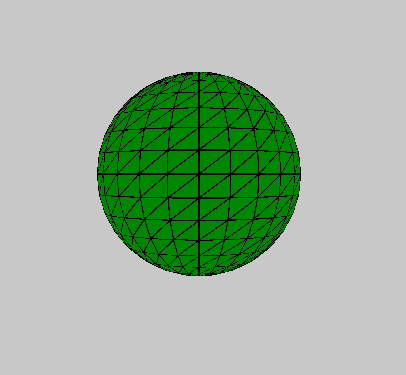
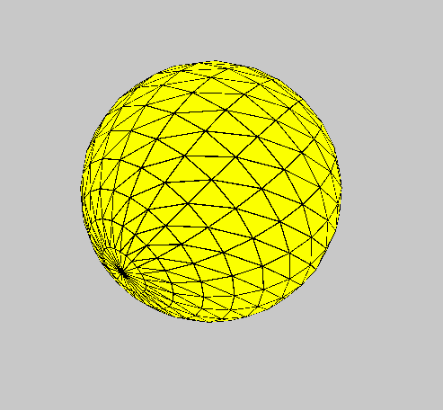

# p5.js |球体()功能

> 原文:[https://www.geeksforgeeks.org/p5-js-sphere-function/](https://www.geeksforgeeks.org/p5-js-sphere-function/)

p5.js 中的**球体()函数**用于绘制给定半径的球体。

**语法:**

```
sphere( radius )
```

**参数:**该功能接受单参数**半径**，存储球体半径。

下面的程序说明了 p5.js 中的 sphere()函数:

**示例 1:** 本示例使用 sphere()函数绘制圆。

```
function setup() {

    // Create Canvas of size 600*600
    createCanvas(600, 600, WEBGL);
}

function draw() {

    // Set background color
    background(200);

    // Set filled color of sphere
    fill('green');

    // sphere() function called
    sphere(100);
}
```

**输出:**


**示例 2:** 本示例使用 sphere()函数绘制圆。

```
function setup() {

    // Create Canvas of size 600*600
    createCanvas(600, 600, WEBGL);
}

function draw() {

    // Set background color
    background(200);

    // Set filled color of sphere
    fill('yellow');

    // Rotate 
    rotateX(frameCount * 0.01);
    rotate(frameCount*0.03);

    // sphere() function called
    sphere(140);
}
```

**输出:**

**参考:**[https://p5js.org/reference/#/p5/sphere](https://p5js.org/reference/#/p5/sphere)