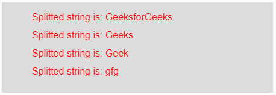
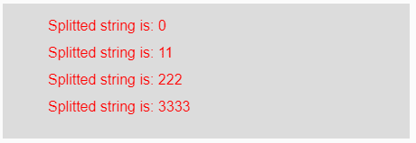

# p5.js | split()功能

> 原文:[https://www.geeksforgeeks.org/p5-js-split-function/](https://www.geeksforgeeks.org/p5-js-split-function/)

p5.js 中的 **split()函数**用于使用分隔符将输入字符串分割成多个部分。该分隔符可以是输入字符串各部分之间使用的任何字符串或符号。

**语法:**

```
split(String, Delimiter)
```

**参数:**该函数接受两个参数，描述如下:

*   **字符串:**这是要拆分的输入字符串。
*   **分隔符:**这是用于分隔输入字符串数据的任何字符串或符号。

**返回值:**返回输入字符串的拆分数据。

下面的程序说明了 p5.js 中的 split()函数。

**示例 1:** 本示例使用 split()函数，使用 delemeter 将输入字符串分解为多个子字符串。

```
function setup() { 

    // Creating Canvas size
    createCanvas(450, 150); 
} 
function draw() { 

    // Set the background color 
    background(220); 

    // Initializing the Strings
    let String = 'GeeksforGeeks/Geeks/Geek/gfg';  

    // Calling to split() function.
    let A = split(String, '/');

    // Set the size of text 
    textSize(16); 

    // Set the text color 
    fill(color('red')); 

    // Getting splitted string
    text("Splitted string is: " + A[0], 50, 30);  
    text("Splitted string is: " + A[1], 50, 60);  
    text("Splitted string is: " + A[2], 50, 90);  
    text("Splitted string is: " + A[3], 50, 120);
} 
```

**输出:**


**示例 2:** 本示例使用 split()函数，使用 delemeter 将输入字符串分解为多个子字符串。

```
function setup() { 

    // Creating Canvas size
    createCanvas(450, 150); 
} 
function draw() { 

    // Set the background color 
    background(220); 

    // Initializing the Strings
    let String = '0&11&222&3333';  

    // Calling to split() function.
    let A = split(String, '&');

    // Set the size of text 
    textSize(16); 

    // Set the text color 
    fill(color('red')); 

    // Getting splitted string
    text("Splitted string is: " + A[0], 50, 30);  
    text("Splitted string is: " + A[1], 50, 60);  
    text("Splitted string is: " + A[2], 50, 90);  
    text("Splitted string is: " + A[3], 50, 120);
} 
```

**输出:**


**参考:**T2】https://p5js.org/reference/#/p5/split