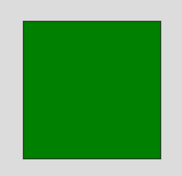
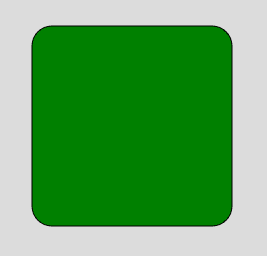
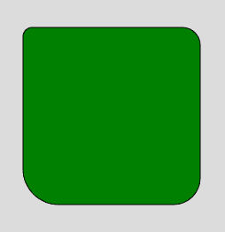

# p5.js | square()函数

> 原文:[https://www.geeksforgeeks.org/p5-js-square-function/](https://www.geeksforgeeks.org/p5-js-square-function/)

**正方形()函数**是 p5.js 中的一个内置函数，用于在屏幕上绘制正方形。正方形包含四条相等的边和四个各成 90 度的角。这是宽度和高度相等的矩形的特例。

**语法:**

```
square( x, y, s, tl, tr, br, bl )
```

**参数:**该函数接受许多参数，如上所述，如下所述:

*   **x:** 用于设置正方形的 x 坐标。
*   **y:** 用于设置正方形的 y 坐标。
*   **s:** 用于设置正方形边的大小。
*   **tl:** 为可选参数，用于设置左上角半径。
*   **tr:** 为可选参数，用于设置右上角半径。
*   **br:** 为可选参数，用于设置右下角半径。
*   **bl:** 为可选参数，用于设置左下角半径。

**例 1:**

```
function setup() { 

    // Create Canvas of given size 
    createCanvas(300, 300); 

} 

function draw() { 

    background(220);

    // Use color() function
    let c = color('green');

    // Use fill() function to fill color
    fill(c);

    // Draw a square
    square(50, 50, 200);

} 
```

**输出:**


**例 2:**

```
function setup() { 

    // Create Canvas of given size 
    createCanvas(300, 300); 

} 

function draw() { 

    background(220);

    // Use color() function
    let c = color('green');

    // Use fill() function to fill color
    fill(c);

    // Draw a square
    square(50, 50, 200, 20);

} 
```

**输出:**


**例 3:**

```
function setup() { 

    // Create Canvas of given size 
    createCanvas(300, 300); 

} 

function draw() { 

    background(220);

    // Use color() function
    let c = color('green');

    // Use fill() function to fill color
    fill(c);

    // Draw a square
    square(50, 50, 200, 10, 20, 30, 40);

} 
```

**输出:**


**在线编辑:**[【https://editor.p5js.org/】](https://editor.p5js.org/)
**环境设置:**[https://www . geeksforgeeks . org/P5-js-soundfile-object-installation-and-methods/](https://www.geeksforgeeks.org/p5-js-soundfile-object-installation-and-methods/)

**参考:**T2】https://p5js.org/reference/#/p5/square