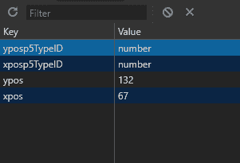

# p5.js | storeItem()功能

> 原文:[https://www.geeksforgeeks.org/p5-js-storeitem-function/](https://www.geeksforgeeks.org/p5-js-storeitem-function/)

**storeItem()** 功能用于在浏览器的本地存储器中存储给定键名下的给定值。本地存储在浏览会话之间持续存在，即使在重新加载页面后也可以存储值。

它可用于保存非敏感信息，如用户首选项。像个人信息这样的敏感数据不应存储，因为这种存储很容易访问。

**语法:**

```
storeItem(key, value)
```

**参数:**该函数接受两个参数，如上所述，如下所述:

*   **键:**这是一个字符串，表示存储值的键。
*   **值:**这是可以存储在键下的任何值。它可以是字符串、数字、布尔值、对象、p5。颜色或 p5.Vector

下面的例子说明了 p5.js 中的 **storeItem()函数**:

**示例:**

```
function setup() {
  createCanvas(400, 300);
  fill("green");
  text("Click anywhere to draw a circle", 10, 20);
  text("The last circle would be redrawn when page is refreshed", 10, 40);

  // get the coordinates 
  // from localStorage
  oldX = getItem('xpos');
  oldY = getItem('ypos');

  // check if the values are
  // actually present (not null)
  if (oldX != null && oldY != null)
    circle(oldX, oldY, 100);

}

function mouseClicked() {
  clear();
  fill("green");
  text("Click anywhere to draw a circle", 10, 20);
  text("The last circle would be redrawn when page is refreshed", 10, 40);

  posX = mouseX;
  posY = mouseY;
  circle(posX, posY, 100);

  // set the coordinates
  // to localStorage
  storeItem('xpos', posX);
  storeItem('ypos', posY);
}
```

**输出:**


*   **Local storage of the browser**
    

    **在线编辑:**[【https://editor.p5js.org/】](https://editor.p5js.org/)
    **环境设置:**[https://www . geeksforgeeks . org/P5-js-soundfile-object-installation-and-methods/](https://www.geeksforgeeks.org/p5-js-soundfile-object-installation-and-methods/)

    **参考:**T2】https://p5js.org/reference/#/p5/storeItem