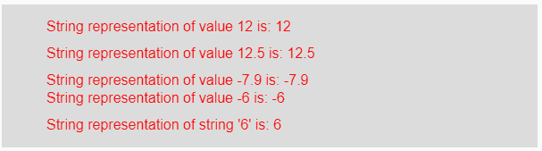
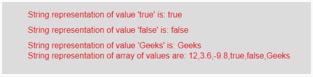

# p5.js | str()函数

> 原文:[https://www.geeksforgeeks.org/p5-js-str-function/](https://www.geeksforgeeks.org/p5-js-str-function/)

p5.js 中的 **str()函数**用于将给定的布尔值、字符串和数值转换为其字符串表示形式。

**语法:**

```
str(value)
```

**参数:**该函数接受单个参数**值**，该值将被转换为其字符串表示。该值可以是整数、浮点、字符串、布尔值、负值或正值以及值数组。

**返回值:**返回转换后的字符串表示形式。

下面的程序说明了 p5.js 中的 str()函数:

**示例 1:** 本示例使用 str()函数将给定的输入值转换为其对应的字符串表示形式。

```
function setup() { 

    // Creating Canvas size
    createCanvas(600, 160); 
} 

function draw() { 

    // Set the background color 
    background(220); 

    // Initializing some values
    let Value1 = 12;
    let Value2 = 12.5;
    let Value3 = -7.9;
    let Value4 = -6;
    let Value5 = "6";

    // Calling to str() function.
    let A = str(Value1);
    let B = str(Value2);
    let C = str(Value3);
    let D = str(Value4);
    let E = str(Value5);

    // Set the size of text 
    textSize(16); 

    // Set the text color 
    fill(color('red')); 

    // Getting string representation
    text("String representation of value 12 is: " + A, 50, 30);
    text("String representation of value 12.5 is: " + B, 50, 60);
    text("String representation of value -7.9 is: " + C, 50, 90);
    text("String representation of value -6 is: " + D, 50, 110);
    text("String representation of string '6' is: " + E, 50, 140);
} 
```

**输出:**


**示例 2:** 本示例使用 str()函数将给定的输入值转换为其对应的字符串表示形式。

```
function setup() { 

    // Creating Canvas size
    createCanvas(600, 140); 
} 

function draw() { 

    // Set the background color 
    background(220); 

    // Initializing some values
    let Value1 = true;
    let Value2 = false;
    let Value3 = "Geeks";
    let Value4 = [12, 3.6, -9.8, true, false, "Geeks"];

    // Calling to str() function.
    let A = str(Value1);
    let B = str(Value2);
    let C = str(Value3);
    let D = str(Value4);

    // Set the size of text 
    textSize(16); 

    // Set the text color 
    fill(color('red')); 

    // Getting string representation
    text("String representation of value 'true' is: " + A, 50, 30);
    text("String representation of value 'false' is: " + B, 50, 60);
    text("String representation of value 'Geeks' is: " + C, 50, 90);
    text("String representation of array of values are: " + D, 50, 110);
}  
```

**输出:**


**参考:**T2】https://p5js.org/reference/#/p5/str