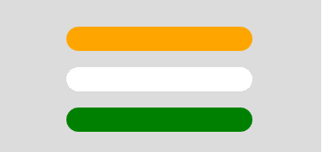

# p5.js |行程()功能

> 原文:[https://www.geeksforgeeks.org/p5-js-stroke-function/](https://www.geeksforgeeks.org/p5-js-stroke-function/)

**描边()功能**用于绘制文字和形状周围的线条和边框。颜色对象可以根据颜色模式按照 RGB 或 HSB 进行设置。颜色对象也可以根据 RGB、RGBA、十六进制 CSS 颜色或命名颜色字符串设置为字符串。

**语法:**

```
stroke( v1, v2, v3, alpha )
```

或者

```
stroke( value )
```

或者

```
stroke( gray, alpha )
```

或者

```
stroke( values )
```

或者

```
stroke( color )
```

**参数:**

*   **v1:** 用于设置相对于当前颜色范围的红色或色相值。
*   **v2:** 用于设置相对于当前颜色范围的绿色或饱和度值。
*   **v3:** 用于设置相对于当前颜色范围的蓝色或亮度值。
*   **alpha:** 用于设置图形的透明度。
*   **值:**用于设置颜色串的值。
*   **灰色:**用于设置灰度值。
*   **值:**是包含红、绿、蓝、阿尔法值的数组。
*   **颜色:**用于设置笔画颜色。

下面的例子说明了 p5.js 中的 stroke()函数:

**例 1:**

```
function setup() { 

    // Create Canvas of given size 
    createCanvas(400, 200); 
} 

function draw() { 

    // Set the background color 
    background(220); 

    // Set the stroke width 
    strokeWeight(10); 

    // Set the stroke
    stroke('green');

    // Set the filled color 
    fill('white'); 

    // Draw the circle 
    circle(90, 90, 34); 

    // Set the text size 
    textSize(20); 

    // Set the text to print 
    text("GeeksForGeeks", 140, 100); 
}
```

**输出:**


**例 2:**

```
function setup() { 

    // Create Canvas of given size 
    createCanvas(400, 200); 
} 

function draw() { 

    // Set the background color 
    background(220); 

    // Set the stroke clor 
    stroke('orange'); 

    // Set the stroke width to 10 
    strokeWeight(30); // Orange 

    // Draw a line 
    line(100, 50, 300, 50); 

    // Set the stroke color 
    stroke('white'); 

    // Set the stroke width to 8 
    strokeWeight(30); // White 

    // Draw a line 
    line(100, 100, 300, 100); 

    // Set stroke color 
    stroke('green'); 

    // Set the stroke width to 6 
    strokeWeight(30); // Green 

    // Draw a line 
    line(100, 150, 300, 150); 
} 
```

**输出:**


**参考:**T2】https://p5js.org/reference/#/p5/stroke