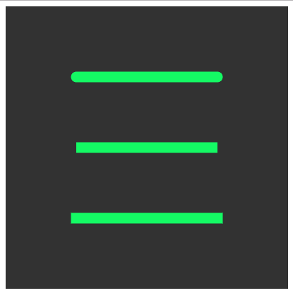

# p5.js | strokeCap()函数

> 原文:[https://www.geeksforgeeks.org/p5-js-strokecap-function/](https://www.geeksforgeeks.org/p5-js-strokecap-function/)

p5.js 中的 strokeCap()函数用于设置行尾的样式。线的端点可以根据其参数 SQUARE、PROJECT 和 ROUND 进行舍入、平方或扩展。默认值为 ROUND。

**语法:**

```
strokeCap( cap )
```

**参数:**该功能接受单参数**帽**，该帽保存行尾样式(圆形、方形或项目)。

**示例:**该示例显示了所有不同种类的线结束边。

```
function setup() {

    // Create canvas of given size
    createCanvas(400, 400);
}

function draw() {

    // Set the background color
    background(50);

    // Set the weight of line stroke
    strokeWeight(15);

    // Set the color of line stroke
    stroke(20, 250, 100);

    // Set different edges style
    strokeCap(SQUARE);
    line(100, 200, 300, 200);

    strokeCap(ROUND);
    line(100, 100, 300, 100);

    strokeCap(PROJECT);
    line(100, 300, 300, 300);
}
```

**输出:**


**参考:**T2】https://p5js.org/reference/#/p5/strokeCap