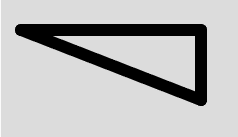
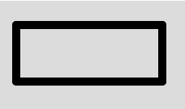

# p5.js | strokeJoin()功能

> 原文:[https://www.geeksforgeeks.org/p5-js-strokejoin-function/](https://www.geeksforgeeks.org/p5-js-strokejoin-function/)

p5.js 中的 **strokeJoin()函数**用于设置连接线段的关节样式。这些接头可以是斜接的、斜接的或倒圆的，并用相应的参数“斜接”、“斜接”和“倒圆”来指定。斜接是默认关节。

**语法:**

```
strokeJoin(join)
```

**参数:**该函数接受单参数**连接**，该连接存储关节参数常量“斜接”、“斜面”或“圆形”。

下面的程序说明了 p5.js 中的 strokeJoin()函数:

**示例 1:** 本示例使用 strokeJoin()函数连接笔画。

```
function setup() {

    // Create Canvas of given size
    createCanvas(380, 170);
}

function draw() {

    // Set the background color
    background(220);

    // Set the stroke weight
    strokeWeight(12);

    // Set strokeJoin function
    strokeJoin(ROUND);

    // Function to create line segment
    line(20, 30, 200, 30);
    line(200, 30, 200, 100);
    line(200, 100, 20, 30);
}
```

**输出:**


**示例 2:** 本示例使用 strokeJoin()函数连接笔画。

```
function setup() {

    // Create Canvas of given size
    createCanvas(380, 170);
}

function draw() {

    // Set the background color
    background(220);

    // Set the stroke weight
    strokeWeight(10);

    // Set strokeJoin function
    strokeJoin(BEVEL);

    // Function to create line segment
    line(20, 30, 200, 30);
    line(200, 30, 200, 100);
    line(200, 100, 20, 100);
    line(20, 100, 20, 30);
}
```

**输出:**


**参考:**T2】https://p5js.org/reference/#/p5/strokeJoin