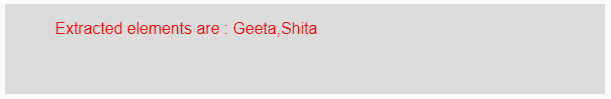
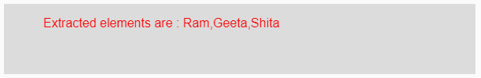

# p5.js | subset()函数

> 原文:[https://www.geeksforgeeks.org/p5-js-subset-function/](https://www.geeksforgeeks.org/p5-js-subset-function/)

p5.js 中的**子集()函数**用于获取给定数组元素的子集。该函数从现有数组中提取元素。

**语法:**

```
subset(Array, Start, Count)
```

**参数:**该功能接受三个参数，如上所述，描述如下:

*   **Array:** 此参数保存要对其执行子集()操作以获取其子集元素的数组元素。
*   **开始:**这是要从哪里提取的数字。它的值从 0 开始。
*   **计数:**这是要提取的元素数量。

**返回值:**返回提取的元素。

下面的程序说明了 p5.js 中的 subset()函数:

**示例 1:** 本示例使用 subset()函数获取给定数组元素的子集。

```
function setup() { 

    // Creating Canvas size
    createCanvas(600, 90); 
} 

function draw() { 

    // Set the background color 
    background(220); 

    // Initializing the array
    let Array = ['Ram', 'Geeta', 'Shita', 'Shyam'];

    // Initializing a start value form where
    // extraction is done
    // it starts form 0.
    let Start = 1;

    // Initializing the count which defines
    // the number of elements to be extracted 
    let Count = 2;

    // Calling to subset() function.
    let A = subset(Array, Start, Count);

    // Set the size of text 
    textSize(16); 

    // Set the text color 
    fill(color('red')); 

    // Getting extracted elements
    text("Extracted elements are : " + A, 50, 30);          
} 
```

**输出:**


**示例 2:** 本示例使用 subset()函数获取给定数组元素的子集。

```
function setup() { 

    // Creating Canvas size
    createCanvas(600, 90); 
} 

function draw() { 

    // Set the background color 
    background(220); 

    // Initializing the array
    let Array = ['Ram', 'Geeta', 'Shita', 'Shyam'];

    // Initializing a start value form where
    // extraction is done
    // it starts form 0.
    let Start = 0;

    // Initializing the count which defines
    // the number of elements to be extracted 
    let Count = 3;

    // Calling to subset() function.
    let A = subset(Array, Start, Count);

    // Set the size of text 
    textSize(16); 

    // Set the text color 
    fill(color('red')); 

    // Getting extracted elements
    text("Extracted elements are : " + A, 50, 30);           
} 
```

**输出:**


**参考:**T2】https://p5js.org/reference/#/p5/subset