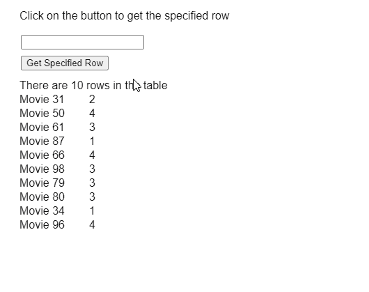

# p5.js 表 getRow()方法

> 原文:[https://www.geeksforgeeks.org/p5-js-table-getrow-method/](https://www.geeksforgeeks.org/p5-js-table-getrow-method/)

p5 的 **getRow()方法**。p5.js 中的表用于将对指定行的引用作为 p5 返回。TableRow 对象。返回的行对象可用于根据需要获取和设置值。

**语法:**

```
getRow( rowID )
```

**参数:**该函数接受如上所述的单个参数，如下所述:

*   **行标识:**是一个数字，表示要返回的行的标识。

下面的例子说明了 p5.js 中的 **getRow()函数**:

**示例:**

```
function setup() {
  createCanvas(500, 400);
  textSize(16);

  rowIDinput = createInput();
  rowIDinput.position(30, 50);

  getColBtn = createButton("Get Specified Row");
  getColBtn.position(30, 80);
  getColBtn.mouseClicked(getRow);

  // Create the table
  table = new p5.Table();

  // Add two columns
  table.addColumn("movie");
  table.addColumn("rating");

  // Add 10 randomly generated rows
  for (let i = 0; i < 10; i++) {
    let newRow = table.addRow();
    newRow.setString("movie",
      "Movie " + floor(random(1, 100)));

    newRow.setString("rating",
      floor(random(1, 5)));
  }

  showTable();
}

function getRow() {
  clear();

  let rowToFind = rowIDinput.value();

  // Get the row values using getRow() method
  if (rowToFind >= 0 &&
      rowToFind < table.getRowCount()) {
    requested_row = table.getRow(rowToFind);

    // Loop through the array
    // to display the values
    text("Row with the same ID: ", 20, 120);
    for (let i = 0; i < requested_row.arr.length; i++) {
      text(requested_row.arr[i],
           20 + i * 120, 140);
    }

  } else
    text("Please enter correct row ID", 20, 120);

  text("Click on the button to get the specified row",
       20, 20);
}

function showTable() {
  clear();

  // Display the total rows present in the table
  text("There are " +
       table.getRowCount() +
       " rows in the table", 20, 120);

  for (let r = 0; r < table.getRowCount(); r++)
    for (let c = 0; c < table.getColumnCount(); c++)
      text(table.getString(r, c),
           20 + c * 100,
           140 + r * 20);

  text("Click on the button to get the specified row",
       20, 20);
}
```

**输出:**


**在线编辑:**[https://editor.p5js.org/](https://editor.p5js.org/)

**环境设置:**

**参考:**T2】https://p5js.org/reference/#/p5.Table/getRow