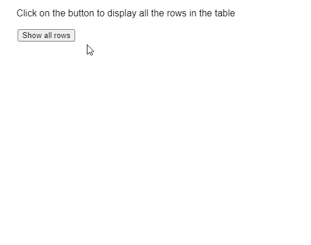

# p5.js 表 getRows()方法

> 原文:[https://www.geeksforgeeks.org/p5-js-table-getrows-method/](https://www.geeksforgeeks.org/p5-js-table-getrows-method/)

p5 的 **getRows()方法**。p5.js 中的 Table 用于返回对表中所有行的引用，作为 p5 的数组。TableRow 对象。每个返回的行对象都可以用于根据需要获取和设置值。

**语法:**

```
getRows()
```

**参数:**此功能不接受任何参数。

以下示例说明了 p5.js 中的 **getRows()函数**:
T3】示例:

## java 描述语言

```
function setup() {
    createCanvas(500, 400);
    textSize(16);

    text("Click on the button to display" +
        "all the rows in the table", 20, 20);

    getColBtn = createButton("Show all rows");
    getColBtn.position(30, 50);
    getColBtn.mouseClicked(showAllRows);

    // Create the table
    table = new p5.Table();

    // Add two columns
    table.addColumn("movie");
    table.addColumn("rating");
    table.addColumn("price");

    // Add 10 randomly generated rows
    for (let i = 0; i < 10; i++) {
        let newRow = table.addRow();
        newRow.setString("movie",
            "Movie " + floor(random(1, 100)));
        newRow.setString("rating",
            floor(random(1, 5)));
        newRow.setString("price",
            "{content}quot; + floor(random(10, 100)));
    }
}

function showAllRows() {
    clear();

    let currentRows = table.getRows();

    // Display the total rows
    // present in the table
    text("There are " +
        currentRows.length +
        " rows in the table", 20, 100);

    for (let r = 0; r < currentRows.length; r++)
        text(currentRows[r].arr.toString(),
            20, 140 + r * 20);

    text("Click on the button to display" +
        "all the rows in the table", 20, 20);
}
```

**输出:**



**在线编辑:**[【https://editor.p5js.org/】](https://editor.p5js.org/)
**环境设置:**[https://www . geeksforgeeks . org/P5-js-soundfile-object-installation-and-methods/](https://www.geeksforgeeks.org/p5-js-soundfile-object-installation-and-methods/)
**参考:**[https://p5js.org/reference/#/p5.Table/getRows](https://p5js.org/reference/#/p5.Table/getRows)