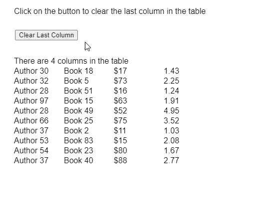

# p5.js 表格移除列()方法

> 原文:[https://www . geesforgeks . org/P5-js-table-remove column-method/](https://www.geeksforgeeks.org/p5-js-table-removecolumn-method/)

p5 的 **removeColumn()方法**。p5.js 中的 Table 用于从表中移除给定的列。要删除的列可以通过使用其标题或索引值(列标识)来指定。

**语法:**

```
removeColumn( column )
```

**参数:**该函数接受如上所述的单个参数，如下所述:

*   **列:**它是一个字符串或数字，表示要删除的列的名称或列标识。

下面的例子说明了 p5.js 中的 **removeColumn()函数**:

**例 1:**

```
function setup() {
    createCanvas(500, 400);
    textSize(16);

    removeColBtn =
        createButton("Clear Last Column");

    removeColBtn.position(30, 60);
    removeColBtn.mouseClicked(clearLastColumn);

    // Create the table
    table = new p5.Table();

    // Add columns
    table.addColumn("author");
    table.addColumn("book");
    table.addColumn("price");
    table.addColumn("rating");

    // Add 10 random rows to the table
    for (let i = 0; i < 10; i++) {
        let newRow = table.addRow();
        newRow.setString("author",
            "Author " + floor(random(1, 100)));
        newRow.setString("book",
            "Book " + floor(random(1, 100)));
        newRow.setString("price",
            "{content}quot; + floor(random(10, 100)));
        newRow.setString("rating",
            random(1, 5).toFixed(2));
    }

    // Display the rows currently present
    getTableRows();
}

function clearLastColumn() {
    clear();
    text("Click on the button to clear "
        + "the last column in the table",
        20, 20);

    // Get the index of the last column
    // of the table
    let lastColumn =
        table.getColumnCount() - 1;

    // Use the removeColumn() method to
    // clear the given column of the table
    if (lastColumn >= 0)
        table.removeColumn(lastColumn);

    text("Last column cleared!", 20, 140);
    getTableRows();
}

function getTableRows() {
    clear();
    text("Click on the button to clear "
        + "the last column in the table",
        20, 20);

    // Display the total columns
    // present in the table
    text("There are " +
        table.getColumnCount() +
        " columns in the table", 20, 120);

    // Show the table with the columns and rows
    for (let r = 0; r < table.getRowCount(); r++)
        for (let c = 0; c < table.getColumnCount(); c++)
            text(table.getString(r, c), 20 
                    + c * 100, 140 + r * 20);
}
```

**输出:**


**例 2:**

```
function setup() {
  createCanvas(500, 400);
  textSize(16);

  columnInput = createInput();
  columnInput.position(30, 40);

  clearColBtn =
    createButton("Clear Given Column");
  clearColBtn.position(30, 70);
  clearColBtn.mouseClicked(clearColumn);

  // Create the table
  table = new p5.Table();

  // Add columns
  table.addColumn("author");
  table.addColumn("book");
  table.addColumn("price");
  table.addColumn("rating");

  // Add 10 random rows to the table
  for (let i = 0; i < 10; i++) {
    let newRow = table.addRow();
    newRow.setString("author",
      "Author " + floor(random(1, 100)));
    newRow.setString("book",
      "Book " + floor(random(1, 100)));
    newRow.setString("price",
      "{content}quot; + floor(random(10, 100)));
    newRow.setString("rating",
       random(1, 5).toFixed(2));
  }

  // Display the rows currently present
  getTableRows();
}

function clearColumn() {
  clear();
  text("Click on the button to clear "
     + "the given column in the table",
    20, 20);

  // Get the index of the column to be removed
  let colToClear =
    int(columnInput.value());

  // Use the removeColumn() method to
  // clear the given column of the table
  if (colToClear >= 0 &&
      colToClear < table.getColumnCount())
    table.removeColumn(colToClear);

  text("Last column cleared!", 20, 140);
  getTableRows();
}

function getTableRows() {
  clear();
  text("Click on the button to clear "
    + "the given column in the table",
    20, 20);

  // Display the total columns 
  // present in the table
  text("There are " + 
    table.getColumnCount() + 
    " columns in the table", 20, 120);

  for (let r = 0; r < table.getRowCount(); r++)
    for (let c = 0; c < table.getColumnCount(); c++)
      text(table.getString(r, c),
           20 + c * 100,
           140 + r * 20);
}
```

**输出:**


**在线编辑:**[https://editor.p5js.org/](https://editor.p5js.org/)

**环境设置:**

**参考:**T2】https://p5js.org/reference/#/p5.Table/removeColumn