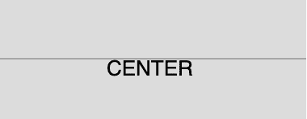

# p5.js | textAlign()函数

> 原文:[https://www.geeksforgeeks.org/p5-js-textalign-function/](https://www.geeksforgeeks.org/p5-js-textalign-function/)

p5.js 中的**文本对齐()功能**用于设置绘图文本的对齐。该函数接受两个参数水平设计和垂直设计。horizAlign 参数设置 x 轴上的对齐方式，vertAlign 参数设置 y 轴上的对齐方式。

**语法:**

```
textAlign( horizAlign, vertAlign)
```

或者

```
textAlign()
```

**参数:**该函数接受两个参数，如上所述，如下所述:

*   **水平对齐:**该参数将文本的水平对齐存储为(左、中或右)。
*   **垂直对齐:**此参数将文本的垂直对齐存储为(顶部、底部、中心或基线)。

下面的程序说明了 p5.js 中的 textAlign()函数:
**示例 1:** 本示例使用 textAlign()函数水平对齐内容。

```
function setup() {

    // Create Canvas of given size
    createCanvas(380, 150);
}

function draw() {

    // Set the background color
    background(220);

    let c = 0.5;

    // Use atan() function to calculate
    // arc tangent value
    let ac = atan(c);

    // Set font size
    textSize(26);

    // Set font color
    fill(color('green'));

    // Set the text alignment to
    // CENTER, RIGHT, LEFT
    textAlign(LEFT);
    text('GEEKS', 100, 30);
    textAlign(CENTER);
    text('for', 100, 60);
    textAlign(RIGHT);
    text('GEEKS', 100, 90);
}
```

**输出:**


**示例 2:** 本示例使用 textAlign()函数垂直对齐内容。

```
function setup() {

    // Create Canvas of given size
    createCanvas(380, 150);
}

function draw() {

    // Set the background color
    background(220);

    // Set the text size
    textSize(26);

    // Set the stroke width
    strokeWeight(0.5);

    // Set the co-ordinates for line
    line(0, height/2, width, height/2);

    // set the alignment for the text
    textAlign(CENTER, TOP);

    // Set the text 
    text('CENTER', 0, height/2, width);
}
```

**输出:**


**参考:**T2】https://p5js.org/reference/#/p5/textAlign