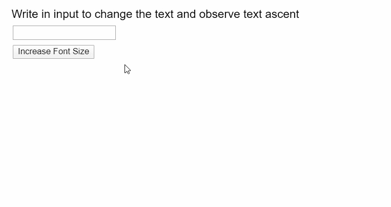
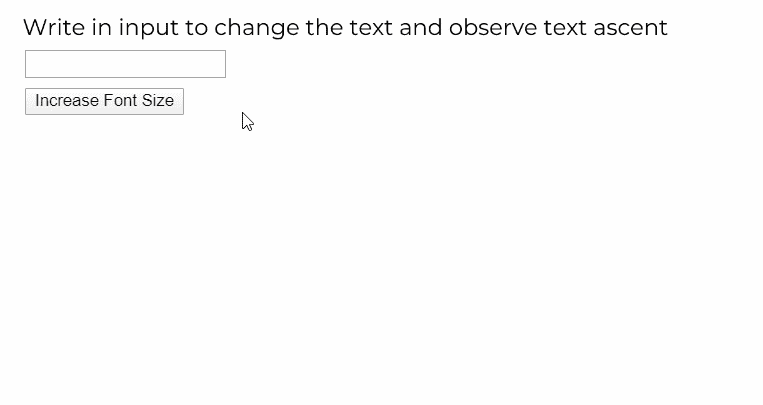

# p5.js | textAscent()功能

> 原文:[https://www.geeksforgeeks.org/p5-js-textascent-function/](https://www.geeksforgeeks.org/p5-js-textascent-function/)

p5.js 中的 **textAscent()函数**用于找出当前字体在当前大小下的升序。上升可以定义为基线上方最高下降字符的距离，以像素为单位。

**语法:**

```
textAscent()
```

**参数:**该功能没有参数。

**返回值:**返回一个数字，以像素为单位表示上升。

下面的例子说明了 p5.js 中的 **textAscent()函数**:

**示例 1:** 本示例显示了使用默认字体的文本上升。

```
let inputElem;
let currfontSize = 24;
let fontBaseline = 150;

function setup() {
  createCanvas(600, 300);

  // Create button to increase font size
  let fontBtn = createButton("Increase Font Size");
  fontBtn.mouseClicked(() => {
    currfontSize += 1;
  });
  fontBtn.position(20, 70);

  // Create input box
  inputElem = createInput("");
  inputElem.position(20, 40);
}

function draw() {
  clear();
  textSize(18);
  text("Write in input to change the text and observe text ascent", 10, 20);
  textSize(currfontSize);

  // This value depends on the font used
  let fontScalar = 0.8;

  // Display text and line if input not empty
  let enteredText = inputElem.value();
  if (enteredText != "") {
    text(enteredText, 20, fontBaseline);

    // Draw the Base line
    stroke("black");
    line(0, fontBaseline, width, fontBaseline);

    // Draw the Ascent Line
    stroke("green");
    ascVal = textAscent() * fontScalar;
    line(0, fontBaseline - ascVal, width, fontBaseline - ascVal);
    noStroke();

    textSize(18);
    text("Text Ascent Value: " + ascVal, 20, 275);
  }
}
```

**输出:**



**示例 2:** 本示例显示了使用自定义字体的文本上升。

```
let inputElem;
let currfontSize = 24;
let fontBaseline = 150;
let newFont;

function preload() {
  newFont = loadFont("fonts/Montserrat.otf");
}

function setup() {
  createCanvas(600, 300);

  textFont(newFont);

  // Create button to increase font size
  let fontBtn = createButton("Increase Font Size");
  fontBtn.mouseClicked(() => {
    currfontSize += 1;
  });
  fontBtn.position(20, 70);

  // Create input box
  inputElem = createInput("");
  inputElem.position(20, 40);
}

function draw() {
  clear();
  textSize(18);
  text("Write in input to change the text and observe text ascent", 10, 20);
  textSize(currfontSize);

  // This value depends on the font used
  let fontScalar = 0.8;

  // Display text and line if input not empty
  let enteredText = inputElem.value();
  if (enteredText != "") {
    text(enteredText, 20, fontBaseline);

    // Draw the Base line
    stroke("black");
    line(0, fontBaseline, width, fontBaseline);

    // Draw the Ascent Line
    stroke("green");
    ascVal = textAscent() * fontScalar;
    line(0, fontBaseline - ascVal, width, fontBaseline - ascVal);
    noStroke();

    textSize(18);
    text("Text Ascent Value: " + ascVal, 20, 275);
  }
}
```

**输出:**



**在线编辑:**[https://editor.p5js.org/](https://editor.p5js.org/)

**环境设置:**

**参考:**T2】https://p5js.org/reference/#/p5/textAscent