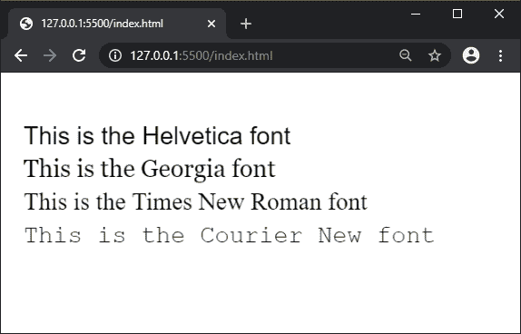
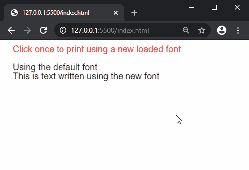

# p5.js | textFont()功能

> 原文:[https://www.geeksforgeeks.org/p5-js-textfont-function/](https://www.geeksforgeeks.org/p5-js-textfont-function/)

p5.js 中的 **textFont()函数**用于指定将使用 text()函数绘制文本的字体。在 WEBGL 模式下，只支持 loadFont()方法加载的字体。

**语法:**

```
textFont( font, size )
```

**参数:**该函数接受两个参数，如上所述，如下所述:

*   **字体:**是一个字符串，它指定了 web safe 字体的名称或者 loadFont()函数加载的字体对象的名称。
*   **size:** 是指定要使用的字体大小的数字。这是一个可选参数。

**返回值:**是包含当前字体的对象。

下面的例子说明了 p5.js 中的 **textFont()函数**:

**示例 1:** 该示例显示了所有系统上普遍可用的网络安全字体的使用。

```
function setup() {
  createCanvas(600, 300);
  textSize(30);

  textFont('Helvetica');
  text('This is the Helvetica font', 20, 80);
  textFont('Georgia');
  text('This is the Georgia font', 20, 120);
  textFont('Times New Roman');
  text('This is the Times New Roman font', 20, 160);
  textFont('Courier New');
  text('This is the Courier New font', 20, 200);
}
```

**输出:**


**示例 2:** 该示例显示了使用 loadFont()函数加载的字体的用法。

```
let newFont;

function preload() {
  newFont = loadFont('fonts/Montserrat.otf');
}

function setup() {
  createCanvas(400, 200);
  textSize(20);
  fill("red");
  text('Click once to print using "
    + "a new loaded font', 20, 20);
  fill("black");

  text('Using the default font', 20, 60);
  text('This is text written using"
        + " the new font', 20, 80);
}

function mouseClicked() {
  textFont(newFont);
  textSize(20);
  text('Using the Montserrat font', 20, 140);
  text('This is text written using the"
       + " new loaded font', 20, 160);
}
```

**输出:**


**在线编辑:**[https://editor.p5js.org/](https://editor.p5js.org/)

**环境设置:**

**参考:**T2】https://p5js.org/reference/#/p5/textFont