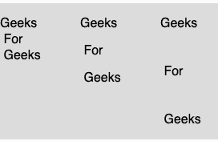

# p5.js | textLeading()函数

> 原文:[https://www.geeksforgeeks.org/p5-js-textleading-function/](https://www.geeksforgeeks.org/p5-js-textleading-function/)

p5.js 中的 **textAlign()函数**用于设置文本行之间的间距，单位为像素。该函数用于对 text()函数的所有后续调用。

**语法:**

```
textLeading(leading)
```

**参数:**该函数接受单个参数**引导**，该参数以像素为单位存储行间距的大小。

下面的程序说明了 p5.js 中的 textLeading()函数:

**示例 1:** 本示例使用 textAlign()函数设置文本行之间的间距(以像素为单位)。

```
function setup() {

    // Create Canvas of given size
    createCanvas(380, 170);
}

function draw() {
    let string = "Geeks \n For \n Geeks";

    // Set the background color
    background(220);

    // Set the text size
    textSize(16);

    // Set the text 
    text(string, 0, 30);

    // set the text leading
    textLeading(34)

    text(string, 100, 30);

    // set the text leading
    textLeading(60)

    text(string, 200, 30);
}
```

**输出:**


**示例 2:** 本示例使用 textAlign()函数返回文本行之间的间距，以像素为单位。

```
function setup() {

    // Create Canvas of given size
    createCanvas(380, 170);
}

function draw() {

    let string = "Geeks \n For \n Geeks";

    // Set the background color
    background(220);

    // Set the text size
    textSize(16);

    // Set the text leading
    textLeading(34)

    // Get the value of text leading
    var u = textLeading();

    // Set the stroke color
    stroke(255, 204, 0);

    // Display the value
    text("Value of TextLeading is : " + u, 50, 30);
}
```

**输出:**


**参考:**T2】https://p5js.org/reference/#/p5/textLeading