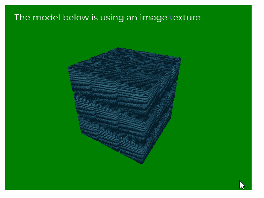
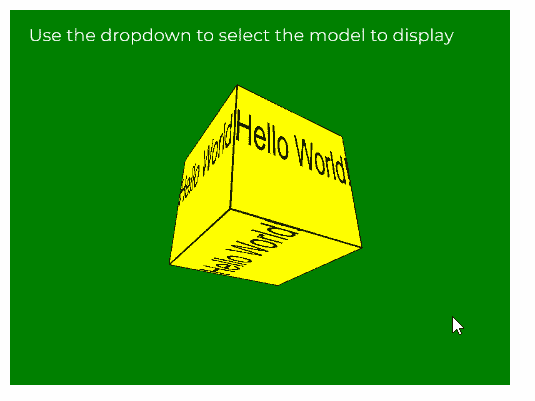

# p5.js 纹理()功能

> 原文:[https://www.geeksforgeeks.org/p5-js-texture-function/](https://www.geeksforgeeks.org/p5-js-texture-function/)

p5.js 中的**纹理()函数**用于为几何对象提供纹理。这个纹理可以是 p5。图像，p5。MediaElement 或 p5。图形对象。

**语法:**

```
texture( tex )
```

**参数:**该函数接受一个参数，如上所述，如下所述。

*   **tex:** 是 p5。图像，p5。MediaElement 或 p5。指定必须在模型上使用的 2D 纹理的图形对象。

下面的程序说明了 p5.js 中的**纹理()**功能:

**例 1:**

```
let cubeObj;
let newFont;

// Load all the models in preload()
function preload() {
  newFont = loadFont("fonts/Montserrat.otf");
  cubeObj = loadModel("models/cube.obj", true);

  textureImg = loadImage("blue_texture.jpg");
}

function setup() {
  createCanvas(400, 300, WEBGL);
  textFont(newFont, 14);
}

function draw() {
  background("green");
  text("The model below is using an"+
       " image texture", -185, -125);

  scale(0.60);
  lights();
  rotateX(frameCount * 0.005);
  rotateY(frameCount * 0.005);
  noStroke();

  texture(textureImg);

  // Load the given model
  model(cubeObj);
}
```

**输出:**



**例 2:**

```
let newFont;
let newTexture;

function preload() {
  newFont = loadFont("fonts/Montserrat.otf");
}

function setup() {
  createCanvas(400, 300, WEBGL);
  textFont(newFont, 14);

  newTexture = createGraphics(400, 200);
  newTexture.textSize(75);
}

function draw() {
  background("green");
  text("Use the dropdown to select the"+
       " model to display", -185, -125);

  newTexture.background("yellow");
  newTexture.text("Hello World!", 0, 100);

  // Use the created texture
  texture(newTexture);
  rotateX(frameCount * 0.01);
  rotateY(frameCount * 0.01);

  box(100);
}
```

**输出:**



**在线编辑:**[https://editor.p5js.org/](https://editor.p5js.org/)

**环境设置:**

**参考:**T2】https://p5js.org/reference/#/p5/texture