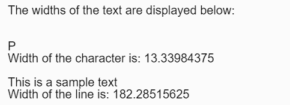
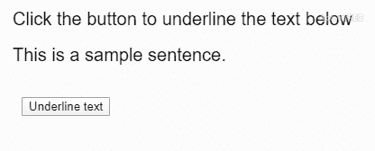

# p5.js | textWidth()函数

> 原文:[https://www.geeksforgeeks.org/p5-js-textwidth-function/](https://www.geeksforgeeks.org/p5-js-textwidth-function/)

**textWidth()** 函数用于计算作为参数给出的文本宽度。

**语法:**

```
textWidth( theText )
```

**参数:**该函数接受如上所述的单个参数，如下所述:

*   **文本:**它保存要测量宽度的字符串。

**返回值:**返回一个数字，表示给定文本的宽度。

下面的例子说明了 p5.js 中的 **textWidth()** 函数:

**例 1:**

```
let sampleChar = "P";
let sampleLine = "This is a sample text";

// Canvas area creating
function setup() {
  createCanvas(400, 200);
  textSize(20);
  text('The widths of the text are '
        + 'displayed below:', 20, 20);

  // Checking textwidth sampleChar
  text(sampleChar, 20, 80);
  let charWidth = textWidth(sampleChar);
  text("Width of the character is: " 
        + charWidth, 20, 100);

  // Checking textwidth sampleLine 
  text(sampleLine, 20, 140);
  let lineWidth = textWidth(sampleLine);
  text("Width of the line is: "
        + lineWidth, 20, 160);
}
```

**输出:**


**示例 2:** 使用文本宽度信息来绘制文本。

```
let sampleText = 
    "This is a sample sentence.";

// Canvas area creating
function setup() {
  createCanvas(400, 200);
  textSize(20);
  text('Click the button to underline'
        + ' the text below', 20, 40);
  text(sampleText, 20, 80);

  // Creating button
  btn = createButton("Underline text");
  btn.position(30, 120);
  btn.mousePressed(underlineText);
}

// Messuring text width and
// creating underline
function underlineText() {
  let width = textWidth(sampleText);
  line(20, 90, width + 20, 90);
}
```

**输出:**


**在线编辑:**[https://editor.p5js.org/](https://editor.p5js.org/)

**环境设置:**

**参考:**T2】https://p5js.org/reference/#/p5/textWidth