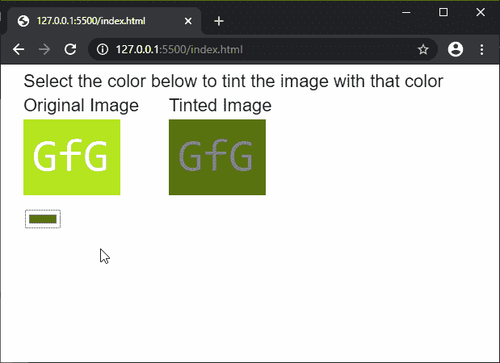
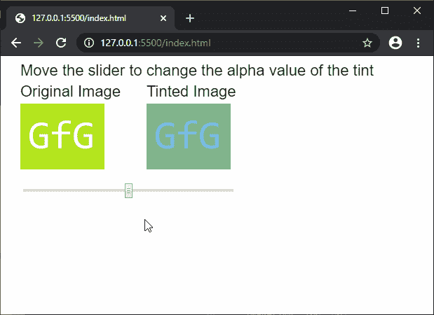

# p5.js | tint()功能

> 原文:[https://www.geeksforgeeks.org/p5-js-tint-function/](https://www.geeksforgeeks.org/p5-js-tint-function/)

**色调()**功能用于设置图像的填充值。它可用于用指定的颜色给图像着色，或通过使用 alpha 值使其透明。可以使用几个参数来指定色调。

**语法:**

```
tint(v1, v2, v3, alpha)
```

```
tint(value)
```

```
tint(gray, alpha)
```

```
tint(values)
```

```
tint(color)
```

**参数:**该函数接受八个参数，如上所述，如下所述:

*   **v1:** 是决定相对于当前颜色范围的红色或色相值的数字。
*   **v2:** 是决定相对于当前颜色范围的绿色或饱和度值的数字。
*   **v3:** 是决定相对于当前颜色范围的蓝色或亮度值的数字。
*   **α:**这是一个定义色调的α值的数字。
*   **值:**它是一个字符串，用于定义色调的颜色。
*   **灰色:**是定义色调灰度值的数字。
*   **值:**它是一组数字，定义了色调颜色的红色、绿色、蓝色和 alpha 分量。
*   **颜色:**是 p5。定义色调颜色的颜色。

以下示例说明了 p5.js 中的**色调()功能**:

**例 1:**

```
function preload() {
  img = loadImage('sample-image.png');
  currTintColor = color('gray');
}

function setup() {
  createCanvas(600, 300);
  textSize(22);

  // Create a color picker for
  // the tint color
  colPicker = createColorPicker('green');
  colPicker.position(30, 180)
  colPicker.input(changeTint);
}

function draw() {
  clear();
  text("Select the color below to tint the"+
        " image with that color", 20, 20);
  text("Original Image", 20, 50);

  // Draw image without tint
  image(img, 20, 60);

  text("Tinted Image", 200, 50);

  // Draw image with tint
  tint(currTintColor);
  image(img, 200, 60);

  // Disable tint for the next
  // draw cycle
  noTint();
}

function changeTint() {
  // Update the current tint color
  currTintColor = colPicker.color();
}
```

**输出:**



**例 2:**

```
function preload() {
  img = loadImage('sample-image.png');
  currTintAlpha = 128;
}

function setup() {
  createCanvas(600, 300);
  textSize(22);

  // Create a slider for
  // the alpha value of the tint
  alphaSlider = createSlider(0, 255, 128);
  alphaSlider.position(30, 180)
  alphaSlider.size(300);
  alphaSlider.input(changeTintAlpha);
}

function draw() {
  clear();
  text("Move the slider to change the alpha"+
        " value of the tint", 20, 20);
  text("Original Image", 20, 50);

  // Draw image without tint
  image(img, 20, 60);

  text("Tinted Image", 200, 50);

  // Draw image with tint and
  // current alpha value
  tint(0, 128, 210, currTintAlpha);
  image(img, 200, 60);

  // Disable tint for the next
  // draw cycle
  noTint();
}

function changeTintAlpha() {
  // Update the current alpha value
  currTintAlpha = alphaSlider.value();
}
```

**输出:**



**在线编辑:**[https://editor.p5js.org/](https://editor.p5js.org/)

**环境设置:**

**参考:**T2】https://p5js.org/reference/#/p5/tint