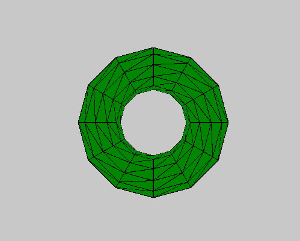

# p5.js | torus()函数

> 原文:[https://www.geeksforgeeks.org/p5-js-torus-function/](https://www.geeksforgeeks.org/p5-js-torus-function/)

p5.js 中的**圆环()函数**用于绘制给定圆环半径和管半径的圆环。

**语法:**

```
torus( radius, tubeRadius, detailX, detailY )
```

**参数:**该功能接受四个参数，如上所述，描述如下:

*   **半径:**此参数存储圆环的半径。*   **结节:**该参数存储管的半径。*   **detailX:** 此参数存储 x 维中的线段数。*   **detailY:** This parameter stores the number of segments in y-dimension.

    下面的程序说明了 p5.js 中的 torus()函数:

    **示例 1:** 本示例使用 torus()函数绘制给定圆环半径和管半径的圆环。

    ```
    function setup() {

        // Create Canvas of size 600*600
        createCanvas(600, 600, WEBGL);
    }

    function draw() {

        // Set background color
        background(200);

        // Set fill color of torus
        fill('green');

        // Call to torus function
        torus(90, 35, 12, 12);
    }
    ```

    **输出:**
    

    **示例 2:** 本示例使用 torus()函数绘制给定圆环半径和管半径的圆环。

    ```
    function setup() {

        // Create Canvas of size 600*600
        createCanvas(600, 600, WEBGL);
    }

    function draw() {

        // Set background color
        background(200);

        // Set fill color of torus
        fill('yellow');

        // Rotate 
        rotateX(frameCount * 0.01);
        rotate(frameCount*0.05);

        // Call to torus function
        torus(90, 35);
    }
    ```

    **输出:**
    
    **参考:**[https://p5js.org/reference/#/p5/torus](https://p5js.org/reference/#/p5/torus)