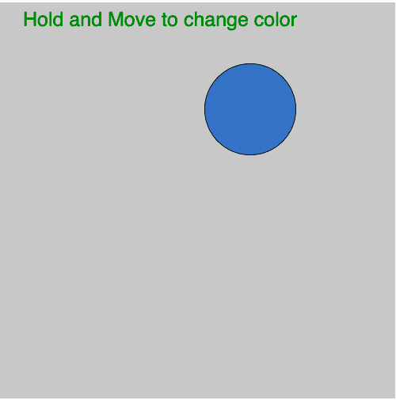
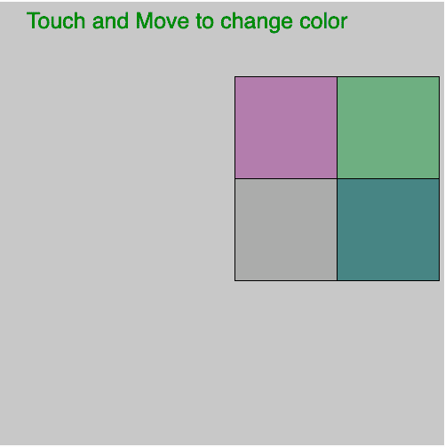

# p5.js Touch | touchMoved()

> 原文:[https://www.geeksforgeeks.org/p5-js-touch-touchmoved/](https://www.geeksforgeeks.org/p5-js-touch-touchmoved/)

p5.js 中的 **touchMoved()** 函数在注册了触摸移动时被调用*。如果没有定义 **touchMoved()** 函数，如果定义了**MouseDrawed()**函数，将改为调用该函数。*

**语法:**

```
touchMoved([Event])

```

下面的程序说明了 p5.js 中的 touchMoved()函数:
**示例-1:**

```
let valueX;
let valueY;

function setup() {

    // Create Canvas of size 500*500
    createCanvas(500, 500);
}

function draw() {

    // set background color
    background(200);

    fill('green');
    // set text and text size
    textSize(25);

    text('Hold and Move to change color', 30, 30);
    // fill color according to touchStarted() 
    fill(valueX, 255 - valueY, 255 - valueX);

    // draw ellipse  
    ellipse(mouseX, mouseY, 115, 115);

}

function touchMoved() {
    valueX = mouseX % 255;
    valueY = mouseY % 255;
}
```

**输出:**


**示例-2:**

```
let valueX;
let valueY;

function setup() {

    // Create Canvas of size 500*500
    createCanvas(500, 500);
}

function draw() {
    // set background color
    background(200);

    fill('green');
    // set text and text size
    textSize(25);

    text('Touch and Move to change color', 30, 30);
    // fill color according to mouseMoved() 
    fill(valueX, 255 - valueY, 255 - valueX);

    // draw rectangle 
    rect(mouseX, mouseY, 115, 115);
    fill(valueY, 255 - valueX, 255 - valueX);

    rect(mouseX, mouseY + 115, 115, 115);
    fill(255 - valueY, 255 - valueX, 255 - valueY);

    rect(mouseX - 115, mouseY, 115, 115);
    fill(255 - valueY, 255 - valueY, 255 - valueY);

    rect(mouseX - 115, mouseY + 115, 115, 115);
}

function touchMoved() {
    valueX = mouseX % 255;
    valueY = mouseY % 255;
}
```

**输出:**

**参考:**[https://p5js.org/reference/#/p5/touchMoved](https://p5js.org/reference/#/p5/touchMoved)