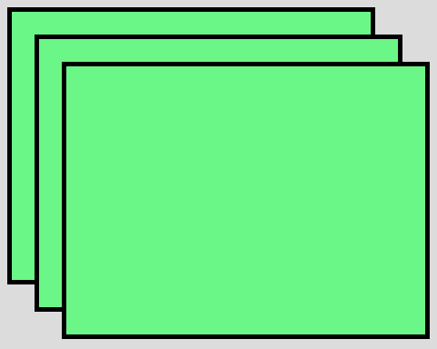
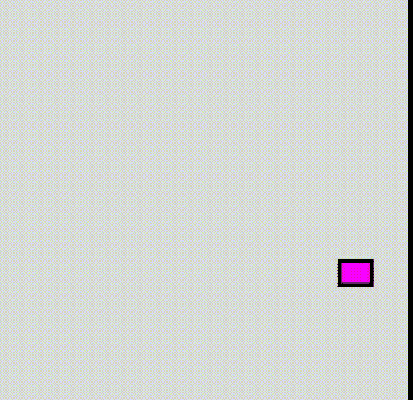

# p5.js | translate()功能

> 原文:[https://www.geeksforgeeks.org/p5-js-translate-function/](https://www.geeksforgeeks.org/p5-js-translate-function/)

p5.js 中的**平移()功能**用于指定显示窗口内物体的位移量。x 参数用于指定左/右平移，y 参数用于指定上/下平移。

**语法:**

```
translate(x, y, [z])
```

或者

```
translate(vector)
```

**参数:**该功能接受三个参数，如上所述，描述如下:

*   **x:** 此参数存储左/右平移的值。
*   **y:** 该参数存储上下平移的值。
*   **z:** 此参数存储正向/反向平移的值。

在另一种语法中，我们只能提供 p5 向量对象。

下面的程序说明了 p5.js 中的 translate()函数:

**示例 1:** 本示例使用 translate()函数指定置换对象的量。

```
function setup() {

    // Create Canvas of given size
    createCanvas(580, 450);
}

function draw() {

    // Set the background color
    background(220);

    // Fill the color
    fill('lightgreen');

    // Set the border weight
    strokeWeight(5);

    // Create rectangle
    rect(10, 10, 400, 300);

    // Translate the rectangle
    translate(30, 30);

    // Create rectangle
    rect(10, 10, 400, 300);

    // Translate the rectangle
    translate(30, 30);

    // Create rectangle
    rect(10, 10, 400, 300);
}
```

**输出:**


**示例 2:** 本示例使用 translate()函数指定在显示窗口内移动对象的量。

```
function setup() {

    // Create Canvas of given size
    createCanvas(580, 450);
}

function draw() {

    // Set the background color
    background(220);

    for(var i=0, j=255; i<255, j>0; i++, j--) {
        fill(i, j, i);
    }

    // Set the stroke weight
    strokeWeight(5);

    // Use translate function
    translate(width / 2, height / 2);

    translate(p5.Vector.fromAngle(millis() / 1000, 200));

    // Create rectangle
    rect(10, 10, 40, 30);
}
```

**输出:**


**参考:**T2】https://p5js.org/reference/#/p5/translate