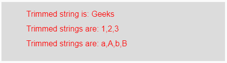
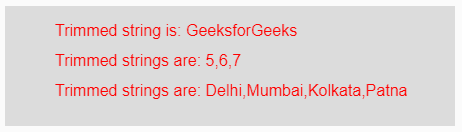

# p5.js | trim()功能

> 原文:[https://www.geeksforgeeks.org/p5-js-trim-function/](https://www.geeksforgeeks.org/p5-js-trim-function/)

p5.js 中的**修剪()功能**用于*从输入字符串*的开头和结尾移除空白字符和制表符。该功能也用于删除回车和 Unicode**“nbsp”**字符。

**语法:**

```
trim(Strings)
```

或者

```
trim(Array_of_Strings)
```

**参数:**该函数接受一个参数**字符串**或一个**字符串数组**，它们将被修剪。

**返回值:**返回修剪后的字符串。

下面的程序举例说明了 p5.js.
**中的 trim()函数示例-1:** 本示例使用 **trim()** 函数删除字符串开头和结尾的空白字符。

```
function setup() {

    // Creating Canvas size
    createCanvas(450, 120);
}

function draw() {

    // Set the background color 
    background(220);

    // Initializing the Strings and Array of strings
    let String = " Geeks ";
    let Array1 = [" 1 ", " 2 ", " 3 "];
    let Array2 = [" a ", " A ", " b ", " B "];

    // Calling to trim() function.
    let A = trim(String);
    let B = trim(Array1);
    let C = trim(Array2);

    // Set the size of text 
    textSize(16);

    // Set the text color 
    fill(color('red'));

    // Getting trimed strings
    text("Trimmed string is: " + A, 50, 30);
    text("Trimmed strings are: " + B, 50, 60);
    text("Trimmed strings are: " + C, 50, 90);
}
```

**输出:**


**示例-2:** 本示例使用**修剪()**功能从字符串的开头和结尾移除制表符。

```
function setup() {

    // Creating Canvas size
    createCanvas(450, 120);
}

function draw() {

    // Set the background color 
    background(220);

    // Initializing the Strings and Array of strings
    let String = "  GeeksforGeeks  ";
    let Array1 = ["  5  ", "  6  ", "  7  "];
    let Array2 = ["  Delhi  ",
                  "  Mumbai  ",
                  "  Kolkata  ",
                  "  Patna  "];

    // Calling to trim() function.
    let A = trim(String);
    let B = trim(Array1);
    let C = trim(Array2);

    // Set the size of text 
    textSize(16);

    // Set the text color 
    fill(color('red'));

    // Getting trimed strings
    text("Trimmed string is: " + A, 50, 30);
    text("Trimmed strings are: " + B, 50, 60);
    text("Trimmed strings are: " + C, 50, 90);

}
```

**输出:**


**参考:**T2】https://p5js.org/reference/#/p5/trim