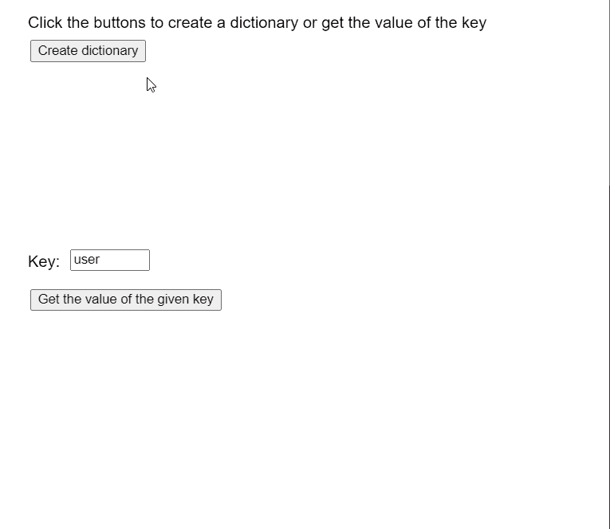

# p5.js TypedDict get()方法

> 原文:[https://www.geeksforgeeks.org/p5-js-typeddict-get-method/](https://www.geeksforgeeks.org/p5-js-typeddict-get-method/)

p5 的 **get()方法**。p5.js 中的 TypedDict 用于返回字典给定键处的值。如果关键字在字典中不存在，该方法返回**未定义的**。键值对是相互映射的两个值的集合。这些值可以通过使用对的关键字部分查询字典来访问。类型化字典可以存储多个键值对，可以使用字典的方法访问这些键值对。

**语法:**

```
get( key )

```

**参数:**该方法接受单个参数，如上所示，讨论如下:

*   **键:**这是一个数字或字符串，表示必须添加到字典中的键。

**返回值:**该方法返回一个数字或字符串，表示存储在给定键上的值。

下面的例子说明了 p5.js 中的 **get()方法**:

**示例:**

## java 描述语言

```
let y = 0;

function setup() {
  createCanvas(550, 500);
  textSize(16);

  text("Click the buttons to create a " +
       "dictionary or get the value of the key",
       20, 20);

  text("Key:", 20, 260);

  key_input = createInput('user');
  key_input.position(70, 250);
  key_input.size(80);

  setBtn = 
    createButton("Create dictionary");
  setBtn.position(30, 40);
  setBtn.mouseClicked(createNewDict);

  getBtn = 
    createButton("Get the value of the given key");
  getBtn.position(30, 290);
  getBtn.mouseClicked(getVal);
}

function createNewDict() {
  clear();

  // Create an object with random values
  let obj = {};
  for (let i = 0; i < 5; i++) {
    let rk = ceil(Math.random() * 100);
    let rn = floor(Math.random() * 100);

    let rkey = "user" + rk;
    let rval = "data" + rn;
    obj[rkey] = rval;

    text("Key: " + rkey + "  Value: " +
         rval, 40, 120 + 20 * i);
  }

  // Create a string dict using the above values
  numDict = createStringDict(obj);

  text("New Dictionary created with values",
       20, 80);

  text("Click the buttons to create a " +
       "dictionary or get the value of the key",
       20, 20);

  text("Key:", 20, 260);
}

function getVal() {

  // Get the key to be retrieved
  let keyToCheck = key_input.value();

  // Get the value of the key from the dictionary
  let keyVal = numDict.get(keyToCheck);

  text("The value at key: " + keyToCheck +
       " is: " + keyVal, 20, 340 + y * 20);

  y++;

  text("Click the buttons to create a " +
       "dictionary or get the value of the key",
       20, 20);
}
```

**输出:**



**在线编辑:**[【https://editor.p5js.org/】](https://editor.p5js.org/)
**环境设置:**[https://www . geeksforgeeks . org/P5-js-soundfile-object-installation-and-methods/](https://www.geeksforgeeks.org/p5-js-soundfile-object-installation-and-methods/)
**参考:**[https://p5js.org/reference/#/p5.TypedDict/get](https://p5js.org/reference/#/p5.TypedDict/get)