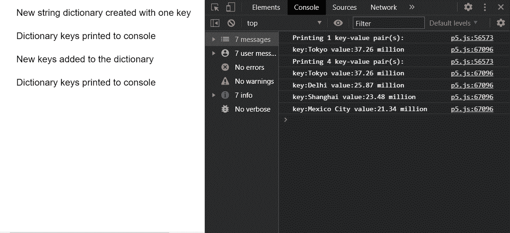

# p5.js TypedDict 打印()方法

> 原文:[https://www.geeksforgeeks.org/p5-js-typeddict-print-method/](https://www.geeksforgeeks.org/p5-js-typeddict-print-method/)

p5 的**打印()方法**。p5.js 中的 TypedDict 用于将字典中当前存在的所有键值对打印到控制台。键值对是相互映射的两个值的集合。这些值可以通过使用对的关键字部分查询字典来访问。类型化字典可以存储多个键值对，可以使用字典的方法访问这些键值对。

**语法:**

```
print()

```

**参数:**此方法不接受任何参数。

下面的例子说明了 p5.js 中的 **print()方法**:

**示例:**

## java 描述语言

```
function setup() {
  createCanvas(550, 300);
  textSize(16);

  let stringDict = 
      createStringDict("Tokyo", "37.26 million");
  text("New string dictionary created " +
       "with one key", 20, 20);

  // Getting the current size of the dictionary
  let currSize = stringDict.size();
  print("Printing " + currSize +
        " key-value pair(s):");

  // Printing all the values to console
  stringDict.print();
  text("Dictionary keys printed to console",
       20, 60);

  let tmpObj = {
    "Delhi": "25.87 million",
    "Shanghai": "23.48 million",
    "Mexico City": "21.34 million"
  };

  // Add the given key to the dictionary
  // specifying the key and value as an object
  stringDict.create(tmpObj);
  text("New keys added to the dictionary",
       20, 100);

  // Getting the current size of the dictionary
  currSize = stringDict.size();
  print("Printing " + currSize +
        " key-value pair(s):");

  // Printing all the values to console
  stringDict.print();
  text("Dictionary keys printed to console",
       20, 140);
}
```

**输出:**



**在线编辑:**[【https://editor.p5js.org/】](https://editor.p5js.org/)
**环境设置:**[https://www . geeksforgeeks . org/P5-js-soundfile-object-installation-and-methods/](https://www.geeksforgeeks.org/p5-js-soundfile-object-installation-and-methods/)
**参考:**[https://p5js.org/reference/#/p5.TypedDict/print](https://p5js.org/reference/#/p5.TypedDict/print)