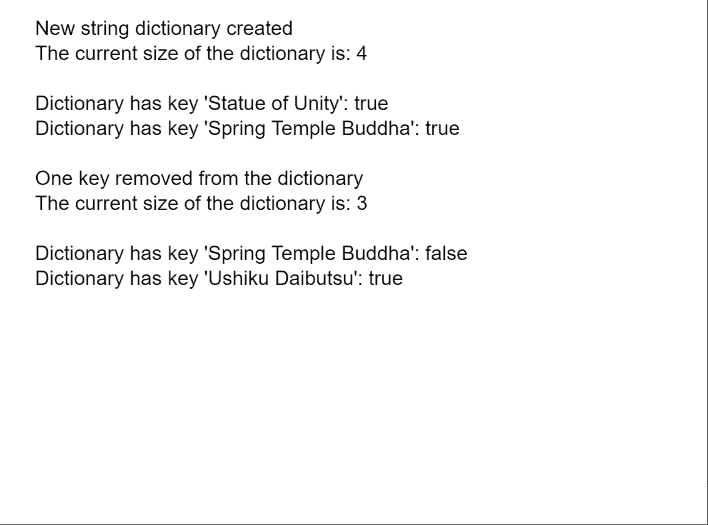

# p5.js TypedDict remove()方法

> 原文:[https://www . geesforgeks . org/P5-js-typedict-remove-method/](https://www.geeksforgeeks.org/p5-js-typeddict-remove-method/)

p5 的**移除()方法**。p5.js 中的 TypedDict 用于从类型化字典中移除给定的键值对。键值对是相互映射的两个值的集合。这些值可以通过使用对的关键字部分查询字典来访问。类型化字典可以存储多个键值对，可以使用字典的方法访问这些键值对。

**语法:**

```
remove( key )

```

**参数:**该方法接受单个参数，如上所示，讨论如下:

*   **键:**这是一个字符串，表示必须在字典中检查的键。

下面的例子说明了 p5.js 中的 **remove()方法**:

**示例:**

## java 描述语言

```
function setup() {
  createCanvas(550, 400);
  textSize(16);

  let tmpObj = {
    "Statue of Unity": "182 m",
    "Spring Temple Buddha": "128 m",
    "Ushiku Daibutsu": "100 m",
    "Great Buddha of Thailand": "92m"
  };

  // Create a new string dictionary
  let stringDict =
      createStringDict(tmpObj);
  text("New string dictionary created", 20, 20);

  // Checking the size of the dictionary
  let currSize = stringDict.size();
  text("The current size of the " +
       "dictionary is: " + currSize, 20, 40);

  let existOne =
      stringDict.hasKey("Statue of Unity");
  text("Dictionary has key " +
       "'Statue of Unity': " +
       existOne, 20, 80);

  let existTwo =
      stringDict.hasKey("Spring Temple Buddha");
  text("Dictionary has key " +
       "'Spring Temple Buddha': " +
       existTwo, 20, 100);

  // Removing one key
  stringDict.remove("Spring Temple Buddha");
  text("One key removed from the dictionary",
       20, 140);

  // Checking the size of the dictionary again
  currSize = stringDict.size();
  text("The current size of the dictionary is: " +
       currSize, 20, 160);

  // Checking for the removed key
  existTwo =
    stringDict.hasKey("Spring Temple Buddha");
  text("Dictionary has key " +
       "'Spring Temple Buddha': " +
       existTwo, 20, 200);

  // Checking the other keys
  let existThree = 
      stringDict.hasKey("Ushiku Daibutsu");
  text("Dictionary has key " +
       "'Ushiku Daibutsu': " +
       existThree, 20, 220);
}
```

**输出:**



**在线编辑:**[【https://editor.p5js.org/】](https://editor.p5js.org/)
**环境设置:**[https://www . geeksforgeeks . org/P5-js-soundfile-object-installation-and-methods/](https://www.geeksforgeeks.org/p5-js-soundfile-object-installation-and-methods/)
**参考:**[https://p5js.org/reference/#/p5.TypedDict/remove](https://p5js.org/reference/#/p5.TypedDict/remove)