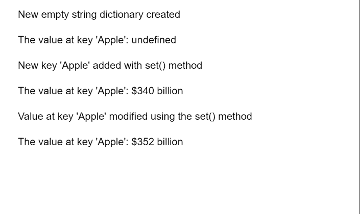

# p5.js TypedDict set()方法

> 原文:[https://www.geeksforgeeks.org/p5-js-typeddict-set-method/](https://www.geeksforgeeks.org/p5-js-typeddict-set-method/)

p5 的**设置()方法**。p5.js 中的 TypedDict 用于在字典的给定键处添加或修改值。键值对是相互映射的两个值的集合。这些值可以通过使用对的关键字部分查询字典来访问。类型化字典可以存储多个键值对，可以使用字典的方法访问这些键值对。

**语法:**

```
set( key, value )

```

**参数:**该方法接受两个参数，如上所示，讨论如下:

*   **键:**这是一个数字或字符串，表示必须添加到字典中的键。
*   **值:**这是一个数字或字符串，表示必须添加到字典中的值。

下面的例子说明了 p5.js 中的 **set()方法**:

**示例:**

## java 描述语言

```
function setup() {
  createCanvas(550, 300);
  textSize(16);

  // Create an empty dictionary
  let stringDict = 
      createStringDict({});
  text("New empty string dictionary created",
       20, 20);

  // Get the value at the given key
  let valOne = stringDict.get('Apple');
  text("The value at key 'Apple': " +
       valOne, 20, 60);

  // Add the given key to the dictionary
  // specifying the key and value
  stringDict.set('Apple', '$340 billion');

  text("New key 'Apple' added with " +
       "set() method", 20, 100)

  // Get the value at the given key
  valOne = stringDict.get('Apple');
  text("The value at key 'Apple': " +
       valOne, 20, 140);

  // Change the value of an already set key
  stringDict.set('Apple', '$352 billion');

  text("Value at key 'Apple' modified using " +
       "the set() method", 20, 180)

  // Get the value at the given key
  valOne = stringDict.get('Apple');
  text("The value at key 'Apple': " +
       valOne, 20, 220);
}
```

**输出:**



**在线编辑:**[【https://editor.p5js.org/】](https://editor.p5js.org/)
**环境设置:**[https://www . geeksforgeeks . org/P5-js-soundfile-object-installation-and-methods/](https://www.geeksforgeeks.org/p5-js-soundfile-object-installation-and-methods/)
**参考:**[https://p5js.org/reference/#/p5.TypedDict/set](https://p5js.org/reference/#/p5.TypedDict/set)