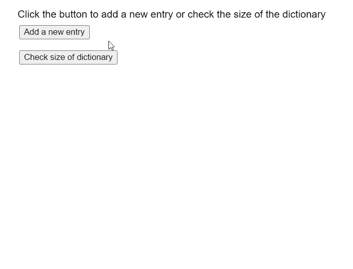

# p5.js TypedDict size()方法

> 原文:[https://www.geeksforgeeks.org/p5-js-typeddict-size-method/](https://www.geeksforgeeks.org/p5-js-typeddict-size-method/)

p5 的**大小()方法**。p5.js 中的 TypedDict 用于获取字典的当前大小。大小表示字典中当前存在的键值对的数量。键值对是相互映射的两个值的集合。这些值可以通过使用对的关键字部分查询字典来访问。类型化字典可以存储多个键值对，可以使用字典的方法访问这些键值对。

**语法:**

```
size()

```

**参数:**此方法不接受任何参数。

下面的例子说明了 p5.js 中的 **size()方法**:

**示例:**

## java 描述语言

```
let tmp = 1;

function setup() {
  createCanvas(550, 500);
  textSize(16);

  text("Click the button to add a new entry " +
       "or check the size of the dictionary",
       20, 20);

  addBtn = createButton("Add a new entry");
  addBtn.position(30, 40);
  addBtn.mouseClicked(addEntry);

  checkBtn =
    createButton("Check size of dictionary");
  checkBtn.position(30, 80);
  checkBtn.mouseClicked(checkSize);

  // Create a string dictionary with one entry
  numDict = createStringDict('k0', 'v0');
}

function addEntry() {

  // Add a new entry to the dictionary
  numDict.create("k" + tmp, "v" + tmp);

  text("New Entry added to the dictionary",
       20, 120 + tmp * 20);

  tmp++;
}

function checkSize() {

  // Get the current size of the dictionary
  let currSize = numDict.size();

  // Display the current size
  text("The current size of the dictionary is: " +
       currSize, 20, 120 + tmp * 20);

  tmp++;
}
```

**输出:**



**在线编辑:**[【https://editor.p5js.org/】](https://editor.p5js.org/)
**环境设置:**[https://www . geeksforgeeks . org/P5-js-soundfile-object-installation-and-methods/](https://www.geeksforgeeks.org/p5-js-soundfile-object-installation-and-methods/)
**参考:**[https://p5js.org/reference/#/p5.TypedDict/size](https://p5js.org/reference/#/p5.TypedDict/size)